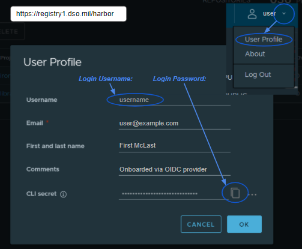

# Zarf K8s Airgap Thingy

This tool creates self-bootstrapping k3s clusters with the requestsed images/manifests embedded to deploy into an airgap Debian or RHEL-based linux environment.  

The result is a portable cluster capable of running [almost anywhere](https://k3s.io/) completely airgapped, and can serve as the foundation for further downstream clusters.

## What's with the name?
### Basically this...


## Usage
---
Zarf is a static go binary that runs on various linux distros to deploy an airgap utility cluster including a docker registry and gitea server, batteries included.  General usage steps:

### 1. Inital setup and config
- Download the files from the [Zarf Releases](https://repo1.dso.mil/platform-one/big-bang/apps/product-tools/zarf/-/releases).
- Verify the downloads with `shasum -c --ignore-missing zarf.sha256`.
- In a new folder or git repo, place a ZarfUpdateConfig `config.yaml` with any changes you need to make, (see [the examples folder](examples) for more info).

  [](https://asciinema.org/a/422834)
### 2. Creating the utility cluster
- Move the `zarf`, `zarf-initialize.tar.zst` files to the system you will install the cluster to.  You can also bring the `zarf.sha256` file with step 1b above if you want to verify the files again when you are in that environment.
- Login or sudo/su to root.
- Run `./zarf initialize --confirm --host=HOSTNAME` where `HOSTNAME` is the DNS or IP you want to use to connect to the cluster.
- After intialization, the CLI will report the location of the Zarf Private CA public cert and credentials for the utility cluster.
- As the CLI will tell you, you can run `/usr/local/bin/k9s` to leverage [k9s](https://k9scli.io/) to watch the changes.

### 3. Adding resources to the utility cluster 
- Folling step 1b, make any necessary edits to the `config.yaml` file.
- Then run `./zarf package create` to produce an `zarf-update.tar.zst` package.
- Move the `zarf-update.tar.zst` file into the same folder on the running utility cluster as in step 2a.
- Login or sudo/su to root.
- Run `./zarf package deploy`, the CLI should automatically place all your packaged resources in the approriate location for immediate use.

&nbsp;
## Development
---

## Prereqs

### Software
To run this tool, you'll need some software pre-installed:

- [Docker](https://www.docker.com/products/docker-desktop) : Provides access to secure build images and assists earthly in keeping builds self-contained, isolated, and repeatable.

### User Accounts
This tool utilizes software pulled from multiple sources and _some_ of them require authenticated access.  You will need to make an account at the following sites if you don't already have access:

- [Iron Bank](https://registry1.dso.mil/) : Platform One's authorized, hardened, and approved container repository. ([product](https://p1.dso.mil/#/products/iron-bank/) [pages](https://ironbank.dso.mil/))

  ---

&nbsp;

## Building

### Step 1 - Login to the Container Registry

This tool executes containerized builds within _secure containers_ so you'll need to be able to pull hardened images from Iron Bank.  Be sure you've logged Docker into the Iron Bank before attempting a build:

<table>
<tr valign="top">
<td>
<div>

```sh
docker login registry1.dso.mil -u <YOUR_USERNAME>
Password: <YOUR_CLI_SECRET>
```

</div>
<div>

---

**Harbor Login Credentials**

Iron Bank images are currently backed by an instance of the [Harbor](https://goharbor.io) registry.

To authenticate with Harbor via Docker you'll need to navigate to the Iron Bank [Harbor UI](https://registry1.dso.mil/harbor), login, and copy down your `CLI Secret`.

You should pass this `CLI Secret` **_instead of your password_** when invoking docker login!

---

</div>
</td>
<td width="503" height="415">
  
</td>
</tr>
</table>

&nbsp;

### Step 2 - Run a Build

Building the package is one command:

```sh
make build-test
```

&nbsp;

### Step 3 - Test Drive

You can try out your new build with a local [Vagrant](https://www.vagrantup.com/) deployment, like so:

```bash
# To test RHEL 7 or 8
make test OS=rhel7
make test OS=rhel8

# To test ubuntu
make test OS=ubuntu

# escalate user once inside VM: vagrant --> root
sudo su
cd /opt/zarf
```

All OS options:
- rhel7
- rhel8
- centos7
- centos8
- ubuntu
- debian 

In less than a minute, you'll have a kubernetes cluster running all the pre-requisites needed to host and deploy mutliple other downstream clusters.

The status of the cluster creation can be monitored with `/usr/local/bin/k9s`

&nbsp;

### Step 4 - Cleanup

You can tear down the local [Vagrant](https://www.vagrantup.com/) deployment, like so:

```bash
# to deescalate user: root --> vagrant
exit

# to exit VM shell
exit

# tear down the VM
make test-close
```
