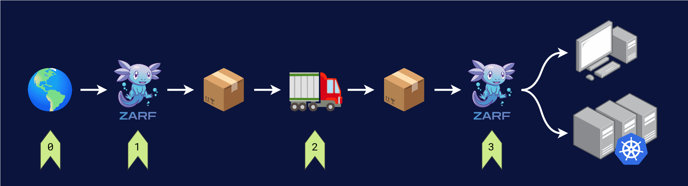
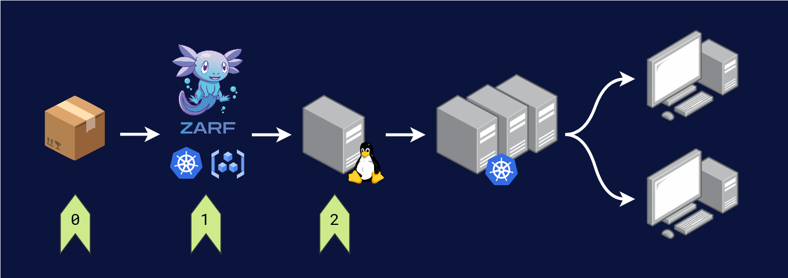

import TabItem from "@theme/TabItem";
import Tabs from "@theme/Tabs";

# Overview


## What is Zarf?

Zarf was created to _**support the declarative creation & distribution of software "packages" into remote/constrained/standalone environments**_.

> "Zarf is a tool to help deploy modern stacks into air-gapped environments; it's all about moving the bits." &mdash; Jeff

Zarf is a free and open-source tool that simplifies the setup and deployment of applications and supporting resources onto air-gapped or disconnected environments. Zarf equips you with the ability to quickly and securely deploy modern software onto complex systems without relying on internet connectivity.

It also simplifies the installation, update, and maintenance of supporting DevSecOps capabilities like Kubernetes clusters and logging stacks, while  providing features like out of the box SBOM compliance. Most importantly though, Zarf keeps applications and systems running even when they are disconnected.

:::note

Check out our [glossary](1-getting-started/0-understand-the-basics.md) for an explanation of common terms used in the project.

:::

## How Zarf Works

Zarf simplifies and standardizes the delivery of complex software deployments. This gives users the ability to reduce tens/hundreds of individual software updates, data transfers, and manual installations to a few simple terminal commands. This tool equips users with the ability to pull, package, and install all of the resources their applications or clusters need to run without being connected to the internet. It can also deploy any necessary resources needed to stand up infrastructure tooling (such as Open Tofu / Terraform).


A typical Zarf deployment is made up of three parts:

1. The [`zarf` binary](./2-the-zarf-cli/index.md):
   - Is a statically compiled Go binary that can be run on any machine, server, or operating system with or without connectivity.
   - Creates packages combining numerous types of software/updates into a single distributable package (while on a network capable of accessing them).
   - Declaratively deploys package contents "into place" for use on production systems (while on an isolated network).
2. A [Zarf init package](./3-create-a-zarf-package/3-zarf-init-package.md):
   - A compressed tarball package that contains the configuration needed to instantiate an environment without connectivity.
   - Automatically seeds your cluster with a container registry or wires up a pre-existing one
   - Provides additional capabilities such as logging, git server support, and/or a K8s cluster.
3. A [Zarf Package](./3-create-a-zarf-package/1-zarf-packages.md):
   - A compressed tarball package that contains all of the files, manifests, source repositories, and images needed to deploy your infrastructure, application, and resources in a disconnected environment.

:::note

For more technical information on how Zarf works and to view the Zarf architecture, visit our [Nerd Notes page](./12-contribute-to-zarf/3-nerd-notes.md).

:::

## Target Use Cases

- Make the delivery of software "across the air gap" an open-source "solved problem".
- Make it trivial to deploy and run Kubernetes apps "at the Edge".
- Make it easy to support GitOps-based K8s cluster updates in isolated environments.
- Make it possible to support GitOps-based K8s cluster updates in internet-connected-but-independent environments (think: dependency caching per availability zone, etc).

## What can be Packaged?

The following types of software can be rolled into a Zarf Package:

- Container images + artifacts: to serve images and OCI artifacts for clusters and other consumers to pull.
- [Repositories](../examples/git-data/README.md): to serve as the git-based "source of truth" for GitOps application deployments.
- Pre-compiled binaries: to provide the software necessary to start and support a cluster.
- [Component actions](3-create-a-zarf-package/7-component-actions.md): to support scripts and commands that run at various stages of the Zarf [package create lifecycle](./3-create-a-zarf-package/5-package-create-lifecycle.md), and [package deploy lifecycle](./4-deploy-a-zarf-package/1-package-deploy-lifecycle.md).
- Helm charts, kustomizations, and other K8s manifests: to apply to a Kubernetes cluster.
- [Data injections](../examples/kiwix/README.md): to declaratively inject data into running containers in a Kubernetes cluster.

## How To Use Zarf

Zarf is intended for use in a software deployment process that looks similar to this:



### (0) Connect to the Internet

Zarf doesn't build software—it helps you distribute software that already exists.

Zarf can pull from various places like Docker Hub, Iron Bank, GitHub, private registries and local filesystems. In order to do this, you must ensure that Zarf has a clear path and appropriate access credentials. Be sure you know what you want to pack and how to access it before you begin using Zarf.

### (1) Create a Package

This part of the process requires access to the internet (or a network that mirrors your resources). When the `zarf` binary is presented with a `zarf.yaml`, it then begins downloading, packing, and compressing the software that you requested. It then outputs a single, ready-to-move distributable called "a package".

For additional information, see the [Creating a package](./5-zarf-tutorials/0-creating-a-zarf-package.md) section.

### (2) Ship the Package to the System Location

Zarf enables secure software delivery for various environments, such as remote, constrained, standalone, and air-gapped systems. Considering there are various target environments with their own appropriate transferring mechanisms, Zarf does not determine _how_ packages are moved so long as they can arrive in your downstream environment.  See [Package Sources](./4-deploy-a-zarf-package/2-package-sources.md) for more information on where Zarf packages can be stored / pulled from.

### (3) Deploy the Package

Once your package has arrived, you will need to:

1. Install the binary onto the system.
2. Initialize a cluster with a zarf init package.
3. Deploy the package to your cluster.

## Cluster Configuration Options

Zarf allows the package to either deploy to an existing K8s cluster or a K3s cluster it creates. This configuration is available on deployment of the init package.

### As an Appliance


In the simplest usage scenario, you deploy the Zarf init package's builtin cluster and use it to serve your application(s) directly to end users. This configuration runs Zarf and it's init package components as a self-contained appliance and is intended for use in environments where you want to run K8s-native tooling but need to keep a small footprint (i.e. single-purpose/constrained/"Edge" environments).

### With an Existing Cluster


In this use case, you configure Zarf to initialize a cluster that already exists within your environment, and use that existing cluster to host and serve your applications.  This configuration is intended for environments that may already have some supporting infrastructure such as disconnected / highly regulated cloud environments.

### As a Utility Cluster



In a more complex use case, you deploy the Zarf init package's builtin cluster and use it to serve resources to further downstream clusters. This configuration makes your Zarf deployment a utility cluster in service of a larger system and is intended for use in places where you want to run independent, full-service production environments with their own lifecycles but you want help tracking, caching and disseminating system/dependency updates.

## Why Use Zarf?

- 💸 **Free and Open-Source.** Zarf will always be free to use and maintained by the open-source community.
- ⭐️ **Zero Dependencies.** As a statically compiled binary, the Zarf CLI has zero dependencies to run on any machine.
- 🔓 **No Vendor Lock.** There is no proprietary software that locks you into using Zarf. If you want to remove it, you still can use your helm charts to deploy your software manually.
- 💻 **OS Agnostic.** Zarf supports numerous operating systems. A full matrix of supported OSes, architectures and featuresets is coming soon.
- 📦 **Highly Distributable.** Integrate and deploy software from multiple secure development environments including edge, embedded systems, secure cloud, data centers, and even local environments.
- 🚀 **Develop Connected, Deploy Disconnected.** Teams can build and configure individual applications or entire DevSecOps environments while connected to the internet. Once created, they can be packaged and shipped to a disconnected environment to be deployed.
- 💿 **Single File Deployments.** Zarf allows you to package the parts of the internet your app needs into a single compressed file to be installed without connectivity.
- ♻️ **Declarative Deployments.** Zarf packages define the precise state for your application enabling it to be deployed the same way every time.
- 🦖 **Inherit Legacy Code.** Zarf packages can wrap legacy code and projects - allowing them to be deployed to modern DevSecOps environments.

## Features

<!-- mirrored from the project's README.md -->

### 📦 Out of the Box Features

- Automate Kubernetes deployments in disconnected environments
- Automate [Software Bill of Materials (SBOM)](./3-create-a-zarf-package/6-package-sboms.md) generation
- Build and [publish packages as OCI image artifacts](./5-zarf-tutorials/7-publish-and-deploy.md)
- Provide a [web dashboard](./4-deploy-a-zarf-package/4-view-sboms.md) for viewing SBOM output
- Create and verify package signatures with [cosign](https://github.com/sigstore/cosign)
- [Publish](./2-the-zarf-cli/100-cli-commands/zarf_package_publish.md), [pull](./2-the-zarf-cli/100-cli-commands/zarf_package_pull.md), and [deploy](./2-the-zarf-cli/100-cli-commands/zarf_package_deploy.md) packages from an [OCI registry](https://opencontainers.org/)
- Powerful component lifecycle [actions](./3-create-a-zarf-package/7-component-actions.md)
- Deploy a new cluster while fully disconnected with [K3s](https://k3s.io/) or into any existing cluster using a [kube config](https://kubernetes.io/docs/concepts/configuration/organize-cluster-access-kubeconfig/)
- Builtin logging stack with [Loki](https://grafana.com/oss/loki/)
- Builtin Git server with [Gitea](https://gitea.com/)
- Builtin Docker registry
- Builtin [K9s Dashboard](https://k9scli.io/) for managing a cluster from the terminal
- [Mutating Webhook](adr/0005-mutating-webhook.md) to automatically update Kubernetes pod's image path and pull secrets as well as [Flux Git Repository](https://fluxcd.io/docs/components/source/gitrepositories/) URLs and secret references
- Builtin [command to find images](./2-the-zarf-cli/100-cli-commands/zarf_prepare_find-images.md) and resources from a Helm chart
- Tunneling capability to [connect to Kuberenetes resources](./2-the-zarf-cli/100-cli-commands/zarf_connect.md) without network routing, DNS, TLS or Ingress configuration required

### 🛠️ Configurable Features

- Customizable [variables and package templates](examples/variables/README.md) with defaults and user prompting
- [Composable packages](./3-create-a-zarf-package/2-zarf-components.md#composing-package-components) to include multiple sub-packages/components
- Component-level OS/architecture filtering

## Quick Start

1. 💻 Select your system's OS below.
2. ❗ Ensure you have the pre-requisite applications running.
3. `$` Enter the commands into your terminal.

<Tabs>
<TabItem value="Linux">

:::info

This quick start requires you to already have:

- [Homebrew](https://brew.sh/) package manager installed on your machine.
- [Docker](https://www.docker.com/) installed and running on your machine.

For more install options please visit our [Getting Started page](./1-getting-started/index.md).

:::

## Linux Commands

```bash
# To install Zarf
brew tap defenseunicorns/tap && brew install zarf

# Next, you will need a Kubernetes cluster. This example uses KIND.
brew install kind && kind delete cluster && kind create cluster


# Then, you will need to deploy the Zarf Init Package
zarf init


# You are ready to deploy any Zarf Package, try out our Retro Arcade!!
zarf package deploy oci://defenseunicorns/dos-games:1.0.0-$(uname -m) --key=https://zarf.dev/cosign.pub
```

:::note

This example shows how to install Zarf with the official (📜) `defenseunicorns` Homebrew tap, however there are many other options to install Zarf on Linux such as:

- 📜 **[official]** Downloading Zarf directly from [GitHub releases](https://github.com/defenseunicorns/zarf/releases)
- 🧑‍🤝‍🧑 **[community]** `apk add` on [Alpine Linux Edge](https://pkgs.alpinelinux.org/package/edge/testing/x86_64/zarf)
- 🧑‍🤝‍🧑 **[community]** `asdf install` with the [ASDF Version Manager](https://github.com/defenseunicorns/asdf-zarf)
- 🧑‍🤝‍🧑 **[community]** `nix-shell`/`nix-env` with [Nix Packages](https://search.nixos.org/packages?channel=23.05&show=zarf&from=0&size=50&sort=relevance&type=packages&query=zarf)

:::

:::tip

Zarf can deploy it's own `k3s` cluster on Linux if you have `root` access by selecting the `k3s` component on `zarf init`.

:::

</TabItem>
<TabItem value="macOS">

:::info

This quick start requires you to already have:

- [Homebrew](https://brew.sh/) package manager installed on your machine.
- [Docker](https://www.docker.com/) installed and running on your machine.

For more install options please visit our [Getting Started page](./1-getting-started/index.md).

:::

## MacOS Commands

```bash
# To install Zarf
brew tap defenseunicorns/tap && brew install zarf

# Next, you will need a Kubernetes cluster. This example uses KIND.
brew install kind && kind delete cluster && kind create cluster


# Then, you will need to deploy the Zarf Init Package
zarf init


# You are ready to deploy any Zarf Package, try out our Retro Arcade!!
zarf package deploy oci://🦄/dos-games:1.0.0-$(uname -m) --key=https://zarf.dev/cosign.pub
```

</TabItem>
<TabItem value="Windows">

## Windows Commands


:::info

There is currently no Zarf Quick Start for Windows, though you can learn how to install Zarf from our Github Releases by visiting the [Getting Started page](./1-getting-started/index.md#downloading-from-github-releases)

:::

```text

Coming soon!

```

</TabItem>
</Tabs>

Zarf is being actively developed by the community. For more information, see our [release notes](https://github.com/defenseunicorns/zarf/releases).
