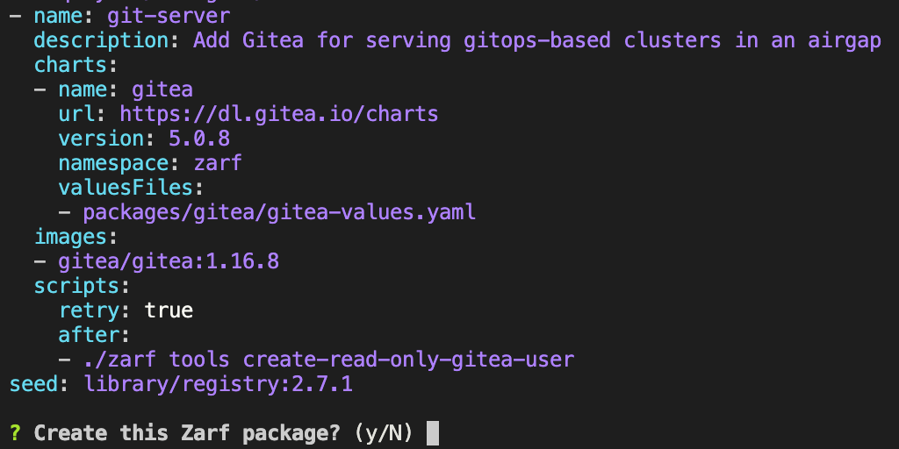

# Using Zarf Package Create

In this walkthrough, we will be demonstrating how to build a Zarf package with `zarf package create`. In fact, we will be building two packages: the first will be the zarf init-package (which will be very useful for nearly every other walkthrough) and the second will be a package that contains a handful of legacy DOS games that we will be using in the [deploying doom](./2-deploying-doom.md) walkthrough later.

When creating a Zarf package, you will need to have an Internet connection so that Zarf can fetch all of the dependencies and resources necessary to build the package. If your package is using images from a private registry or is referencing repositories in a private repository, you will need to have your credentials configured on your machine for Zarf to be able to fetch the resources.

## Walkthrough Prerequisites

1. The [Zarf](https://github.com/defenseunicorns/zarf) repository cloned: ([git clone instructions](https://docs.github.com/en/repositories/creating-and-managing-repositories/cloning-a-repository))
2. Zarf binary installed on your $PATH: ([install instructions](../3-getting-started/index.md#installing-zarf))

## Building the init-package

Creating zarf packages is a simple process that can be completed in a single command; [`zarf package create`](../4-user-guide/1-the-zarf-cli/100-cli-commands/zarf_package_create.md). This command looks for a `zarf.yaml` file in the specified directory and creates a package containing all the resources the file defines. More information about what a Zarf package is can be found on the [Zarf Packages](../4-user-guide/2-zarf-packages/1-zarf-packages.md) page.

```bash
cd zarf                   # Enter the zarf repository that you have cloned down

zarf package create .     # Run the command to create the zarf package
                          # Enter the image and tag for the Zarf agent image
                          # Type `y` when prompted and then hit the enter key
```

This set of commands will create a zarf package in the current directory. In this case, the package name should look something like `zarf-init-amd64-v0.24.0.tar.zst`, although it might be slightly different depending on your system architecture.

:::note
If you continue without entering an agent image, package create will fail. The Zarf Agent is required to rewrite Kubernetes objects in the air gap via what is known as a Mutating Webhook. More technical information about it can be found [here](../6-contribute-to-zarf/3-nerd-notes.md).
:::

When you execute the `zarf package create` command, Zarf will prompt you to confirm that you want to create the package by displaying the package definition and asking you to respond with either `y` or `n`.



:::info
You can skip this confirmation by adding the `--confirm` flag when running the command. This will look like: `zarf package create . --confirm`
:::

Congratulations! You've just created your first Zarf package!

## Building the game package

Creating the game package is just as simple as creating the init package! Once again, we will be using the `zarf package create` command to create the package. Since the game package definition lives in `examples/dos-games` within the Zarf repository, the only thing we need to do differently is to specify the correct directory. This time we will skip the confirmation prompt by adding the `--confirm` flag to save a bit of time.

```bash
zarf package create examples/dos-games --confirm
```

This will create a zarf package in the current directory with a package name that looks something like `zarf-package-dos-games-amd64.tar.zst`, although it might be slightly different depending on your system architecture.

Congratulations! You've built the games package. Now, let's [deploy it](./2-deploying-doom.md) and start playing!
