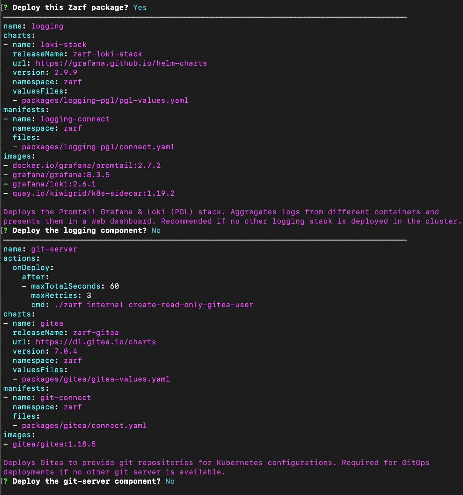

# Initializing a K8s Cluster

In this walkthrough, we will demonstrate how to initialize Zarf onto a K8s cluster. This is done by running the [`zarf init`](../4-user-guide/1-the-zarf-cli/100-cli-commands/zarf_init.md) command, which uses a specialized package called an 'init-package'. More information about this specific package can be found [here](../4-user-guide/2-zarf-packages/3-the-zarf-init-package.md).

## Prerequisites

1. The [Zarf](https://github.com/defenseunicorns/zarf) repository cloned: ([`git clone` Instructions](https://docs.github.com/en/repositories/creating-and-managing-repositories/cloning-a-repository))
1. Zarf binary installed on your $PATH: ([Install Instructions](../3-getting-started.md#installing-zarf))
1. An init-package built/downloaded: ([init-package Build Instructions](./0-using-zarf-package-create.md)) or ([Download Location](https://github.com/defenseunicorns/zarf/releases))
1. A Kubernetes cluster to work with: ([Local k8s Cluster Instructions](./#setting-up-a-local-kubernetes-cluster))

## Walkthrough

1. Run the `zarf init` command on your cluster.

```sh
$ zarf init
```

2. Confirm Package Deployment: <br/> 
- When prompted to deploy the package select `y` for Yes, then hit the `enter` key. <br/>

3. Decline Optional Components: <br/>
- When prompted to deploy the K3s component select `n` for No, then hit the `enter` key. <br/>
- When prompted to deploy the logging component select `n` for No, then hit the `enter` key. <br/>
- When prompted to deploy the git-server component select `n` for No, then hit the `enter` key.

:::note
You will only be prompted to deploy the k3s component if you are on a Linux machine
:::


:::info
More information about the init-package and its components can be found [here](../4-user-guide/2-zarf-packages/3-the-zarf-init-package.md)
:::
<iframe src="/docs/walkthroughs/zarf_init.html" height="800px" width="100%"></iframe>

### Validating the Deployment
After the `zarf init` command is done running, you should see a few new `zarf` pods in the Kubernetes cluster.

```bash
zarf tools monitor

# Note you can press `0` if you want to see all namespaces and CTRL-C to exit
```


## Cleaning Up

The [`zarf destroy`](../4-user-guide/1-the-zarf-cli/100-cli-commands/zarf_destroy.md) command will remove all of the resources that were created by the initialization command. This command will leave you with a clean cluster that you can either destroy or use for another walkthrough.

```sh
zarf destroy --confirm
```