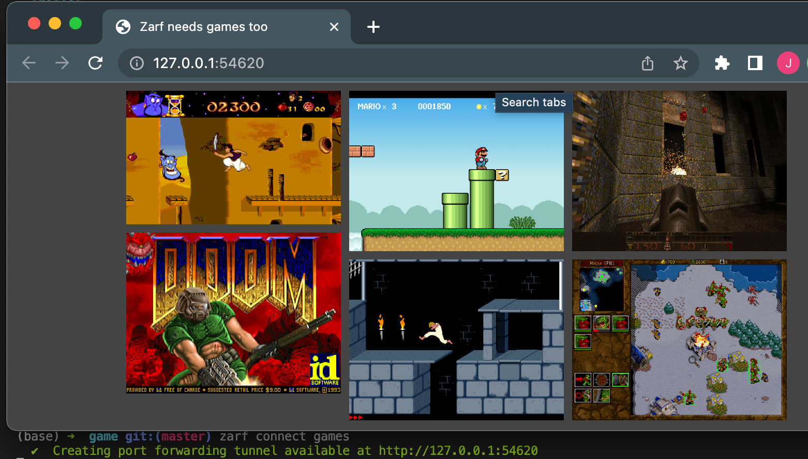

# Deploying Zarf Packages 

## Introduction

In this walkthrough, we are going to deploy a fun application onto your cluster. In previous walkthroughs, we learned how to [create a package](./0-using-zarf-package-create.md) and [initialize a cluster](./1-initializing-a-k8s-cluster.md). We will be leveraging all that past work and then go the extra step of deploying an application onto our cluster with the `zarf package deploy` command. While this example game is nothing crazy, this walkthrough hopes to show how simple it is to deploy packages of functionality into a Kubernetes cluster.

## System Requirements

- You'll need an internet connection to grab the Zarf source code that includes the games example

## Prerequisites

Prior to this walkthrough you'll want to have a working cluster with Zarf initialized
1.  Zarf binary installed on your $PATH: ([Installing Zarf](../3-getting-started.md#installing-zarf))
2. [Initialize a cluster](./1-initializing-a-k8s-cluster.md).
3. The [game package created](./0-using-zarf-package-create.md).

## Walkthrough
[](https://youtu.be/7hDK4ew_bTo "Deploying Packages with Zarf")

1. Navigate to the folder when you created the package in a previous walkthrough. (see [prerequisites](#prerequisites))

```sh
$ cd src/github.com/defenseunicorns/zarf/examples/dos-games
```

2. Use the `zarf package deploy` command to deploy the zarf games package.

<iframe src="/docs/walkthroughs/package_deploy_deploy.html" width="100%" height="595px"></iframe>

3. If you do not provide the path to the package as an argument to the `zarf package deploy` command, Zarf will prompt you asking for you to choose which package you want to deploy. You can use the `tab` key, to be prompted for avaiable packages in the current working directory.

<iframe src="/docs/walkthroughs/package_deploy_suggest.html" width="100%" height="150px"></iframe>
By hitting 'tab', you can use the arrow keys to select which package you want to deploy. Since we are deploying the games package in this walkthrough, we will select that package and hit 'enter'.

<iframe src="/docs/walkthroughs/package_deploy_suggestions.html" width="100%" height="150px"></iframe>
As we have seen a few times now, we are going to be prompted with a confirmation dialog asking us to confirm that we want to deploy this package onto our cluster.

<iframe src="/docs/walkthroughs/package_deploy_deploy.html" width="100%" height="595px"></iframe>


4. If you did not use the `--confirm` flag to automatically confirm that you want to install this package, press `y` for yes.  Then hit the `enter` key.

<iframe src="/docs/walkthroughs/package_deploy_deploy_bottom.html" width="100%" height="400px"></iframe>

### Connecting to the Games

When the games package finishes deploying, you should get an output that lists a couple of new commands that you can use to connect to the games. These new commands were defined by the creators of the games package to make it easier to access the games. By typing the new command, your browser should automatically open up and connect to the application we just deployed into the cluster, using the `zarf connect` command.

<iframe src="/docs/walkthroughs/package_deploy_connect.html" width="100%"></iframe>



:::note
If your browser doesn't automatically open up, you can manually go to your browser and copy the IP address that the command printed out into the URL bar.
:::

:::note
The `zarf connect games` will continue running in the background until you close the connection by pressing the `ctrl + c` (`control + c` on a mac) in your terminal to terminate the process.
:::

## Removal

1. Use the `zarf package list` command to get a list of the installed packages.  This will give you the name of the games package to remove it.

<iframe src="/docs/walkthroughs/package_deploy_list.html" width="100%"></iframe>

2. Use the `zarf package remove` command to remove the `dos-games` package.  Don't forget the `--confirm` flag.  Otherwise you'll receive an error.

<iframe src="/docs/walkthroughs/package_deploy_remove_no_confirm.html" width="100%" height="425px"></iframe>

3. You can also use the `zarf package remove` command with the zarf package file, to remove the package.  Again don't forget the `--confirm` flag.

<iframe src="/docs/walkthroughs/package_deploy_remove_by_file.html" width="100%"></iframe>

The dos-games package has now been removed from your cluster.

## Troubleshooting

### Unable to connect to the Kubernetes cluster.

#### Example

<iframe src="/docs/walkthroughs/troubleshoot_unreachable.html" width="100%" height="200px"></iframe>

#### Remediation

If you receive this error, either you don't have a Kubernetes cluster, your cluster is down, or your cluster is unreachable.

1. Check your kubectl configuration, then try again.  For more information about kubectl configuration see [Configure Access to Multiple Clusters](https://kubernetes.io/docs/tasks/access-application-cluster/configure-access-multiple-clusters/) from the Kubernetes documentation.

If you need to setup a cluster, you can perform the following.

1. Deploy a Kubernetes cluster with the [Creating a K8s Cluster with Zarf](./4-creating-a-k8s-cluster-with-zarf.md) walkthrough.
2. Perform the [Initialize a cluster](./1-initializing-a-k8s-cluster.md) walkthrough.

After that you can try deploying the package again.

### Secrets "zarf-state" not found.

#### Example

<iframe src="/docs/walkthroughs/troubleshoot_uninitialized.html" width="100%" height="250px"></iframe>

#### Remediation

If you receive this error when zarf is attempting to deploy the `BASELINE COMPONENT`, this means you have not initialized the kubernetes cluster.  This is one of the prerequisites for this walkthrough.  Perform the [Initialize a cluster](./1-initializing-a-k8s-cluster.md) walkthrough, then try again.

## Credits

:sparkles: Special thanks to these fine references! :sparkles:

- <https://www.reddit.com/r/programming/comments/nap4pt/dos_gaming_in_docker/>
- <https://earthly.dev/blog/dos-gaming-in-docker/>
