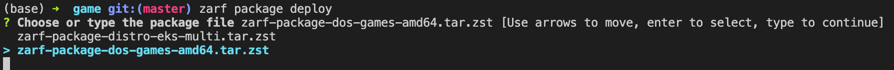
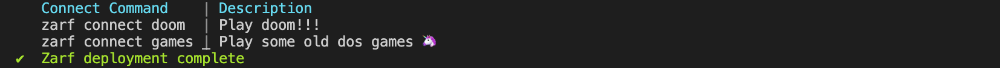

# Deploying Zarf Packages 

## Introduction

In this walkthrough, we are going to deploy a fun application onto your cluster. In previous walkthroughs, we learned how to [create a package](./0-using-zarf-package-create.md) and [initialize a cluster](./1-initializing-a-k8s-cluster.md). We will be leveraging all that past work and then go the extra step of deploying an application onto our cluster with the `zarf package deploy` command. While this example game is nothing crazy, this walkthrough hopes to show how simple it is to deploy packages of functionality into a Kubernetes cluster.

## System Requirements

- You'll need an internet connection to grab the Zarf source code that includes the games example

## Prerequisites

Prior to this walkthrough you'll want to have a working cluster with Zarf initialized
1.  Zarf binary installed on your $PATH: ([Installing Zarf](../3-getting-started.md#installing-zarf))
2. [Initialize a cluster](./1-initializing-a-k8s-cluster.md).
3. The [game package created](./0-using-zarf-package-create.md).

## Walkthrough
[](https://youtu.be/7hDK4ew_bTo "Deploying Packages with Zarf")

1. Navigate to the folder when you created the package in a previous walkthrough. (see [prerequisites](#prerequisites))`
```sh
$ cd src/github.com/defenseunicorns/zarf/examples/dos-games
```

2. Use the `zarf package deploy` command to deploy the zarf games package.
```sh
$ zarf package deploy zarf-package-dos-games-arm64.tar.zst

Saving log file to
/var/folders/bk/rz1xx2sd5zn134c0_j1s2n5r0000gp/T/zarf-2023-03-20-13-11-30-1741110763.log
  ✔  Loading Zarf Package zarf-package-dos-games-arm64.tar.zst

kind: ZarfPackageConfig
metadata:
  name: dos-games
  description: Simple example to load classic DOS games into K8s in the airgap
  architecture: arm64
build:
  terminal: DougMBP
  user: doug
  architecture: arm64
  timestamp: Mon, 20 Mar 2023 13:11:05 -0400
  version: v0.24.3
  migrations:
  - scripts-to-actions
components:
- name: baseline
  required: true
  manifests:
  - name: multi-games
    namespace: zarf
    files:
    - manifests/deployment.yaml
    - manifests/service.yaml
  images:
  - defenseunicorns/zarf-game:multi-tile-dark
This package has 1 artifacts with software bill-of-materials (SBOM) included. You can view them now
in the zarf-sbom folder in this directory or to go directly to one, open this in your browser:
/Users/doug/src/github.com/defenseunicorns/zarf/examples/dos-games/zarf-sbom/sbom-viewer-defenseunicorns_zarf-game_multi-tile-dark.html

* This directory will be removed after package deployment.

? Deploy this Zarf package? (y/N)
```

3. If you do not provide the path to the package as an argument to the `zarf package deploy` command, Zarf will prompt you asking for you to choose which package you want to deploy. You can use the `tab` key, to be prompted for avaiable packages in the current working directory.


By hitting 'tab', you can use the arrow keys to select which package you want to deploy. Since we are deploying the games package in this walkthrough, we will select that package and hit 'enter'.


As we have seen a few times now, we are going to be prompted with a confirmation dialog asking us to confirm that we want to deploy this package onto our cluster.

```sh
$ zarf package deploy

Saving log file to
/var/folders/bk/rz1xx2sd5zn134c0_j1s2n5r0000gp/T/zarf-2023-03-20-13-44-16-531270948.log
? Choose or type the package file zarf-package-dos-games-arm64.tar.zst
  ✔  Loading Zarf Package zarf-package-dos-games-arm64.tar.zst

kind: ZarfPackageConfig
metadata:
  name: dos-games
  description: Simple example to load classic DOS games into K8s in the airgap
  architecture: arm64
build:
  terminal: DougMBP
  user: doug
  architecture: arm64
  timestamp: Mon, 20 Mar 2023 13:11:05 -0400
  version: v0.24.3
  migrations:
  - scripts-to-actions
components:
- name: baseline
  required: true
  manifests:
  - name: multi-games
    namespace: zarf
    files:
    - manifests/deployment.yaml
    - manifests/service.yaml
  images:
  - defenseunicorns/zarf-game:multi-tile-dark
This package has 1 artifacts with software bill-of-materials (SBOM) included. You can view them now
in the zarf-sbom folder in this directory or to go directly to one, open this in your browser:
/Users/doug/src/github.com/defenseunicorns/zarf/examples/dos-games/zarf-sbom/sbom-viewer-defenseunicorns_zarf-game_multi-tile-dark.html

* This directory will be removed after package deployment.

? Deploy this Zarf package? (y/N)
```

4. If you did not use the `--confirm` flag to automatically confirm that you want to install this package, press `y` for yes.  Then hit the `enter` key.

```sh
? Deploy this Zarf package? Yes


  📦 BASELINE COMPONENT


  ✔  Loading the Zarf State from the Kubernetes cluster
  ✔  Creating port forwarding tunnel at http://127.0.0.1:64051/v2/_catalog
  ✔  Storing images in the zarf registry
  ✔  Starting helm chart generation multi-games
  ✔  Processing helm chart raw-dos-games-baseline-multi-games:0.1.1679333724 from Zarf-generated helm chart
  ✔  Zarf deployment complete

     Connect Command    | Description
     zarf connect doom  | Play doom!!!
     zarf connect games | Play some old dos games 🦄
$
```

### Connecting to the Games

When the games package finishes deploying, you should get an output that lists a couple of new commands that you can use to connect to the games. These new commands were defined by the creators of the games package to make it easier to access the games. By typing the new command, your browser should automatically open up and connect to the application we just deployed into the cluster, using the `zarf connect` command.


```sh
$ zarf connect games
```


:::note
If your browser doesn't automatically open up, you can manually go to your browser and copy the IP address that the command printed out into the URL bar.
:::

:::note
The `zarf connect games` will continue running in the background until you close the connection by pressing the `ctrl + c` (`control + c` on a mac) in your terminal to terminate the process.
:::

## Removal

1. Use the `zarf package list` command to get a list of the installed packages.  This will give you the name of the games package to remove it.

```sh
$ zarf package list

Saving log file to
/var/folders/bk/rz1xx2sd5zn134c0_j1s2n5r0000gp/T/zarf-2023-03-20-13-36-47-4085856631.log
     Package   | Components
     init      | [zarf-injector zarf-seed-registry zarf-registry zarf-agent]
     dos-games | [baseline]
```

2. Use the `zarf package remove` command to remove the `dos-games` package.  Don't forget the `--confirm` flag.  Otherwise you'll receive an error.

```sh
$ zarf package remove dos-games

Saving log file to
/var/folders/bk/rz1xx2sd5zn134c0_j1s2n5r0000gp/T/zarf-2023-03-20-13-39-27-1596633612.log
Error: required flag(s) "confirm" not set
Usage:
  zarf package remove {PACKAGE_NAME|PACKAGE_FILE} [flags]

Aliases:
  remove, u

Flags:
      --components string   Comma-separated list of components to uninstall
      --confirm             REQUIRED. Confirm the removal action to prevent accidental deletions
  -h, --help                help for remove

Global Flags:
  -a, --architecture string   Architecture for OCI images
      --insecure              Allow access to insecure registries and disable other recommended security enforcements. This flag should only be used if you have a specific reason and accept the reduced security posture.
  -l, --log-level string      Log level when running Zarf. Valid options are: warn, info, debug, trace (default "info")
      --no-log-file           Disable log file creation
      --no-progress           Disable fancy UI progress bars, spinners, logos, etc
      --tmpdir string         Specify the temporary directory to use for intermediate files
      --zarf-cache string     Specify the location of the Zarf cache directory (default "~/.zarf-cache")

Error: required flag(s) "confirm" not set
$ zarf package remove dos-games --confirm

Saving log file to
/var/folders/bk/rz1xx2sd5zn134c0_j1s2n5r0000gp/T/zarf-2023-03-20-13-39-34-125487641.log
  ⠴  purge requested for zarf-f53a99d4a4dd9a3575bedf59cd42d48d751ae866
$
```

3. You can also use the `zarf package remove` command with the zarf package file, to remove the package.  Again don't forget the `--confirm` flag.

```sh
$ zarf package remove zarf-package-dos-games-arm64.tar.zst --confirm

Saving log file to
/var/folders/bk/rz1xx2sd5zn134c0_j1s2n5r0000gp/T/zarf-2023-03-20-13-41-08-3031835072.log
  ⠴  purge requested for zarf-f53a99d4a4dd9a3575bedf59cd42d48d751ae866
$
```

The dos-games package has now been removed from your cluster.

## Troubleshooting

### Unable to connect to the Kubernetes cluster, or timed out waiting for cluster to report healthy.

#### Example

```sh
? Deploy this Zarf package? Yes


  📦 BASELINE COMPONENT


     ERROR:  Failed to deploy package: unable to deploy all components in this Zarf Package: unable to deploy
             component baseline: unable to connect to the Kubernetes cluster: timed out waiting for cluster to
             report healthy
$
```

#### Remediation

If you receive this error, either you don't have a Kubernetes cluster, your cluster is down, or your cluster is unreachable.

1. Check your kubectl configuration, then try again.  For more information about kubectl configuration see [Configure Access to Multiple Clusters](https://kubernetes.io/docs/tasks/access-application-cluster/configure-access-multiple-clusters/) from the Kubernetes documentation.

If you need to setup a cluster, you can perform the following.

1. Deploy a Kubernetes cluster with the [Creating a K8s Cluster with Zarf](./4-creating-a-k8s-cluster-with-zarf.md) walkthrough.
2. Perform the [Initialize a cluster](./1-initializing-a-k8s-cluster.md) walkthrough.

After that you can try deploying the package again.

### Secrets "zarf-state" not found.

#### Example

```sh
? Deploy this Zarf package? Yes


  📦 BASELINE COMPONENT


  ⠋  Loading the Zarf State from the Kubernetes cluster (0s)
     ERROR:  Failed to deploy package: unable to deploy all components in this Zarf Package: unable to deploy
             component baseline: unable to get the updated value template: unable to load the Zarf State from the
             Kubernetes cluster: secrets "zarf-state" not found
$
```

#### Remediation

If you receive this error when zarf is attempting to deploy the `BASELINE COMPONENT`, this means you have not initialized the kubernetes cluster.  This is one of the prerequisites for this walkthrough.  Perform the [Initialize a cluster](./1-initializing-a-k8s-cluster.md) walkthrough, then try again.

## Credits

:sparkles: Special thanks to these fine references! :sparkles:

- <https://www.reddit.com/r/programming/comments/nap4pt/dos_gaming_in_docker/>
- <https://earthly.dev/blog/dos-gaming-in-docker/>
