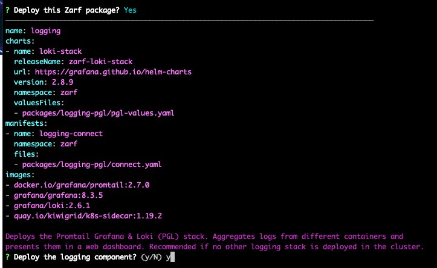

# Add Logging to an Existing Zarf Cluster with Zarf Init

## Introduction

In this walkthrough, we are going to show how you can use a Zarf component to inject zero-config, centralized logging into your Zarf cluster.

More specifically, you'll be adding a [Promtail / Loki / Grafana (PLG)](https://github.com/grafana/loki) stack to the [Doom Walkthrough](./2-deploying-doom.md) by installing Zarf's "logging" component.

## System Requirements

- You'll need an internet connection to grab the Zarf Init Package if it's not already on your machine.

## Prerequisites

Prior to this walkthrough you'll want to have a working cluster with Zarf initialized
1.  Zarf binary installed on your $PATH: ([Installing Zarf](../3-getting-started.md#installing-zarf))
2. [Initialize a cluster](./1-initializing-a-k8s-cluster.md).

## Walkthrough
[](https://youtu.be/FYkafs1idlQ "Add Logging to an existing Zarf Cluster with Zarf Init")

1. Run the `zarf init` command on your cluster.

```sh
zarf init
```

2. When prompted to deploy the package select `y` for Yes, then hit the `enter` 
key. <br/> When prompted to deploy the logging component select `y` for Yes, then hit the `enter` key.




4. You can automatically accept the logging component, and confirm the package using the `--confirm` and `--components` flags.

<html>
<head>
<style type="text/css">
body {background-color: black;}
pre {
	font-weight: normal;
	color: #bbb;
	white-space: -moz-pre-wrap;
	white-space: -o-pre-wrap;
	white-space: -pre-wrap;
	white-space: pre-wrap;
	word-wrap: break-word;
	overflow-wrap: break-word;
}
b {font-weight: normal}
b.BOLD {color: #fff}
b.ITA {font-style: italic}
b.UND {text-decoration: underline}
b.STR {text-decoration: line-through}
b.UNDSTR {text-decoration: underline line-through}
b.BLK {color: #000000}
b.RED {color: #aa0000}
b.GRN {color: #00aa00}
b.YEL {color: #aa5500}
b.BLU {color: #0000aa}
b.MAG {color: #aa00aa}
b.CYN {color: #00aaaa}
b.WHI {color: #aaaaaa}
b.HIK {color: #555555}
b.HIR {color: #ff5555}
b.HIG {color: #55ff55}
b.HIY {color: #ffff55}
b.HIB {color: #5555ff}
b.HIM {color: #ff55ff}
b.HIC {color: #55ffff}
b.HIW {color: #ffffff}
b.BBLK {background-color: #000000}
b.BRED {background-color: #aa0000}
b.BGRN {background-color: #00aa00}
b.BYEL {background-color: #aa5500}
b.BBLU {background-color: #0000aa}
b.BMAG {background-color: #aa00aa}
b.BCYN {background-color: #00aaaa}
b.BWHI {background-color: #aaaaaa}
</style>
</head>
<body>
<pre>
<b class=WHI>$ zarf init --components=logging --confirm</b>
<b class=YEL>Saving log file to</b>
<b class=YEL>/var/folders/bk/rz1xx2sd5zn134c0_j1s2n5r0000gp/T/zarf-2023-03-21-11-11-27-1795990445.log</b>
<b class=YEL></b>
  •  <b style="color:#55ffff;"></b><b style="color:#55ffff;">Loading Zarf Package /Users/jason/.zarf-cache/zarf-init-arm64-v0.24.3.tar.zst</b>
  •  <b style="color:#55ffff;"></b><b style="color:#55ffff;">Loading Zarf Package /Users/jason/.zarf-cache/zarf-init-arm64-v0.24.3.tar.zst</b>

<b style="color:#55ffff;">kind</b>:<b style="color:#ff55ff;"> ZarfInitConfig</b>
<b style="color:#ff55ff;"></b><b style="color:#55ffff;">metadata</b>:<b style="color:#55ffff;"></b>
<b style="color:#55ffff;">  name</b>:<b style="color:#ff55ff;"> init</b>
<b style="color:#ff55ff;">  </b><b style="color:#55ffff;">description</b>:<b style="color:#ff55ff;"> Used to establish a new Zarf cluster</b>
<b style="color:#ff55ff;">  </b><b style="color:#55ffff;">architecture</b>:<b style="color:#ff55ff;"> arm64</b>
<b style="color:#ff55ff;"></b><b style="color:#55ffff;">build</b>:<b style="color:#55ffff;"></b>
<b style="color:#55ffff;">  terminal</b>:<b style="color:#ff55ff;"> fv-az488-281</b>
<b style="color:#ff55ff;">  </b><b style="color:#55ffff;">user</b>:<b style="color:#ff55ff;"> runner</b>
<b style="color:#ff55ff;">  </b><b style="color:#55ffff;">architecture</b>:<b style="color:#ff55ff;"> arm64</b>
<b style="color:#ff55ff;">  </b><b style="color:#55ffff;">timestamp</b>:<b style="color:#ff55ff;"> Sun, 26 Feb 2023 01:28:31 +0000</b>
<b style="color:#ff55ff;">  </b><b style="color:#55ffff;">version</b>:<b style="color:#ff55ff;"> v0.24.3</b>
<b style="color:#ff55ff;">  </b><b style="color:#55ffff;">migrations</b>:
  -<b style="color:#ff55ff;"> scripts-to-actions</b>
<b style="color:#ff55ff;"></b><b style="color:#55ffff;">components</b>:
-<b style="color:#55ffff;"> name</b>:<b style="color:#ff55ff;"> zarf-injector</b>
<b style="color:#ff55ff;">  </b><b style="color:#55ffff;">description</b>: |
<b style="color:#ff55ff;">    Bootstraps a Kubernetes cluster by cloning a running pod in the cluster and hosting the registry image.</b>
<b style="color:#ff55ff;">    Removed and destroyed after the Zarf Registry is self-hosting the registry image.</b>
<b style="color:#ff55ff;">  </b><b style="color:#55ffff;">required</b>:<b style="color:#ffffff;"> true</b>
<b style="color:#ffffff;">  </b><b style="color:#55ffff;">cosignKeyPath</b>:<b style="color:#ff55ff;"> cosign.pub</b>
<b style="color:#ff55ff;">  </b><b style="color:#55ffff;">files</b>:
  -<b style="color:#55ffff;"> source</b>:<b style="color:#ff55ff;"> sget://defenseunicorns/zarf-injector:arm64-2023-02-09</b>
<b style="color:#ff55ff;">    </b><b style="color:#55ffff;">target</b>:<b style="color:#ff55ff;"> "###ZARF_TEMP###/zarf-injector"</b><b style="color:#55ffff;"></b>
<b style="color:#55ffff;">    executable</b>:<b style="color:#ffffff;"> true</b>
<b style="color:#ffffff;"></b>-<b style="color:#55ffff;"> name</b>:<b style="color:#ff55ff;"> zarf-seed-registry</b>
<b style="color:#ff55ff;">  </b><b style="color:#55ffff;">description</b>: |
<b style="color:#ff55ff;">    Deploys the Zarf Registry using the registry image provided by the Zarf Injector.</b>
<b style="color:#ff55ff;">  </b><b style="color:#55ffff;">required</b>:<b style="color:#ffffff;"> true</b>
<b style="color:#ffffff;">  </b><b style="color:#55ffff;">charts</b>:
  -<b style="color:#55ffff;"> name</b>:<b style="color:#ff55ff;"> docker-registry</b>
<b style="color:#ff55ff;">    </b><b style="color:#55ffff;">releaseName</b>:<b style="color:#ff55ff;"> zarf-docker-registry</b>
<b style="color:#ff55ff;">    </b><b style="color:#55ffff;">version</b>:<b style="color:#ff55ff;"> 1.0.0</b>
<b style="color:#ff55ff;">    </b><b style="color:#55ffff;">namespace</b>:<b style="color:#ff55ff;"> zarf</b>
<b style="color:#ff55ff;">    </b><b style="color:#55ffff;">valuesFiles</b>:
    -<b style="color:#ff55ff;"> packages/zarf-registry/registry-values.yaml</b>
<b style="color:#ff55ff;">    </b>-<b style="color:#ff55ff;"> packages/zarf-registry/registry-values-seed.yaml</b>
<b style="color:#ff55ff;">    </b><b style="color:#55ffff;">localPath</b>:<b style="color:#ff55ff;"> packages/zarf-registry/chart</b>
<b style="color:#ff55ff;"></b>-<b style="color:#55ffff;"> name</b>:<b style="color:#ff55ff;"> zarf-registry</b>
<b style="color:#ff55ff;">  </b><b style="color:#55ffff;">description</b>: |
<b style="color:#ff55ff;">    Updates the Zarf Registry to use the self-hosted registry image. </b>
<b style="color:#ff55ff;">    Serves as the primary docker registry for the cluster.</b>
<b style="color:#ff55ff;">  </b><b style="color:#55ffff;">required</b>:<b style="color:#ffffff;"> true</b>
<b style="color:#ffffff;">  </b><b style="color:#55ffff;">charts</b>:
  -<b style="color:#55ffff;"> name</b>:<b style="color:#ff55ff;"> docker-registry</b>
<b style="color:#ff55ff;">    </b><b style="color:#55ffff;">releaseName</b>:<b style="color:#ff55ff;"> zarf-docker-registry</b>
<b style="color:#ff55ff;">    </b><b style="color:#55ffff;">version</b>:<b style="color:#ff55ff;"> 1.0.0</b>
<b style="color:#ff55ff;">    </b><b style="color:#55ffff;">namespace</b>:<b style="color:#ff55ff;"> zarf</b>
<b style="color:#ff55ff;">    </b><b style="color:#55ffff;">valuesFiles</b>:
    -<b style="color:#ff55ff;"> packages/zarf-registry/registry-values.yaml</b>
<b style="color:#ff55ff;">    </b><b style="color:#55ffff;">localPath</b>:<b style="color:#ff55ff;"> packages/zarf-registry/chart</b>
<b style="color:#ff55ff;">  </b><b style="color:#55ffff;">manifests</b>:
  -<b style="color:#55ffff;"> name</b>:<b style="color:#ff55ff;"> registry-connect</b>
<b style="color:#ff55ff;">    </b><b style="color:#55ffff;">namespace</b>:<b style="color:#ff55ff;"> zarf</b>
<b style="color:#ff55ff;">    </b><b style="color:#55ffff;">files</b>:
    -<b style="color:#ff55ff;"> packages/zarf-registry/connect.yaml</b>
<b style="color:#ff55ff;">  </b>-<b style="color:#55ffff;"> name</b>:<b style="color:#ff55ff;"> kep-1755-registry-annotation</b>
<b style="color:#ff55ff;">    </b><b style="color:#55ffff;">namespace</b>:<b style="color:#ff55ff;"> zarf</b>
<b style="color:#ff55ff;">    </b><b style="color:#55ffff;">files</b>:
    -<b style="color:#ff55ff;"> packages/zarf-registry/configmap.yaml</b>
<b style="color:#ff55ff;">  </b><b style="color:#55ffff;">images</b>:
  -<b style="color:#ff55ff;"> registry:2.8.1</b>
<b style="color:#ff55ff;"></b>-<b style="color:#55ffff;"> name</b>:<b style="color:#ff55ff;"> zarf-agent</b>
<b style="color:#ff55ff;">  </b><b style="color:#55ffff;">description</b>: |
<b style="color:#ff55ff;">    A Kubernetes mutating webhook to enable automated URL rewriting for container</b>
<b style="color:#ff55ff;">    images and git repository references in Kubernetes manifests. This prevents</b>
<b style="color:#ff55ff;">    the need to manually update URLs from their original sources to the Zarf-managed</b>
<b style="color:#ff55ff;">    docker registry and git server.</b>
<b style="color:#ff55ff;">  </b><b style="color:#55ffff;">required</b>:<b style="color:#ffffff;"> true</b>
<b style="color:#ffffff;">  </b><b style="color:#55ffff;">actions</b>:<b style="color:#55ffff;"></b>
<b style="color:#55ffff;">    onCreate</b>:<b style="color:#55ffff;"></b>
<b style="color:#55ffff;">      before</b>:
      -<b style="color:#55ffff;"> cmd</b>:<b style="color:#ff55ff;"> make init-package-local-agent AGENT_IMAGE="agent:v0.24.3"</b>
<b style="color:#ff55ff;">  </b><b style="color:#55ffff;">manifests</b>:
  -<b style="color:#55ffff;"> name</b>:<b style="color:#ff55ff;"> zarf-agent</b>
<b style="color:#ff55ff;">    </b><b style="color:#55ffff;">namespace</b>:<b style="color:#ff55ff;"> zarf</b>
<b style="color:#ff55ff;">    </b><b style="color:#55ffff;">files</b>:
    -<b style="color:#ff55ff;"> packages/zarf-agent/manifests/service.yaml</b>
<b style="color:#ff55ff;">    </b>-<b style="color:#ff55ff;"> packages/zarf-agent/manifests/secret.yaml</b>
<b style="color:#ff55ff;">    </b>-<b style="color:#ff55ff;"> packages/zarf-agent/manifests/deployment.yaml</b>
<b style="color:#ff55ff;">    </b>-<b style="color:#ff55ff;"> packages/zarf-agent/manifests/webhook.yaml</b>
<b style="color:#ff55ff;">  </b><b style="color:#55ffff;">images</b>:
  -<b style="color:#ff55ff;"> ghcr.io/defenseunicorns/zarf/agent:v0.24.3</b>
<b style="color:#ff55ff;"></b>-<b style="color:#55ffff;"> name</b>:<b style="color:#ff55ff;"> logging</b>
<b style="color:#ff55ff;">  </b><b style="color:#55ffff;">description</b>: |
<b style="color:#ff55ff;">    Deploys the Promtail Grafana &amp; Loki (PGL) stack. </b>
<b style="color:#ff55ff;">    Aggregates logs from different containers and presents them in a web dashboard. </b>
<b style="color:#ff55ff;">    Recommended if no other logging stack is deployed in the cluster.</b>
<b style="color:#ff55ff;">  </b><b style="color:#55ffff;">charts</b>:
  -<b style="color:#55ffff;"> name</b>:<b style="color:#ff55ff;"> loki-stack</b>
<b style="color:#ff55ff;">    </b><b style="color:#55ffff;">releaseName</b>:<b style="color:#ff55ff;"> zarf-loki-stack</b>
<b style="color:#ff55ff;">    </b><b style="color:#55ffff;">url</b>:<b style="color:#ff55ff;"> https://grafana.github.io/helm-charts</b>
<b style="color:#ff55ff;">    </b><b style="color:#55ffff;">version</b>:<b style="color:#ff55ff;"> 2.8.9</b>
<b style="color:#ff55ff;">    </b><b style="color:#55ffff;">namespace</b>:<b style="color:#ff55ff;"> zarf</b>
<b style="color:#ff55ff;">    </b><b style="color:#55ffff;">valuesFiles</b>:
    -<b style="color:#ff55ff;"> packages/logging-pgl/pgl-values.yaml</b>
<b style="color:#ff55ff;">  </b><b style="color:#55ffff;">manifests</b>:
  -<b style="color:#55ffff;"> name</b>:<b style="color:#ff55ff;"> logging-connect</b>
<b style="color:#ff55ff;">    </b><b style="color:#55ffff;">namespace</b>:<b style="color:#ff55ff;"> zarf</b>
<b style="color:#ff55ff;">    </b><b style="color:#55ffff;">files</b>:
    -<b style="color:#ff55ff;"> packages/logging-pgl/connect.yaml</b>
<b style="color:#ff55ff;">  </b><b style="color:#55ffff;">images</b>:
  -<b style="color:#ff55ff;"> docker.io/grafana/promtail:2.7.0</b>
<b style="color:#ff55ff;">  </b>-<b style="color:#ff55ff;"> grafana/grafana:8.3.5</b>
<b style="color:#ff55ff;">  </b>-<b style="color:#ff55ff;"> grafana/loki:2.6.1</b>
<b style="color:#ff55ff;">  </b>-<b style="color:#ff55ff;"> quay.io/kiwigrid/k8s-sidecar:1.19.2</b>
<b style="color:#ff55ff;"></b>-<b style="color:#55ffff;"> name</b>:<b style="color:#ff55ff;"> git-server</b>
<b style="color:#ff55ff;">  </b><b style="color:#55ffff;">description</b>: |
<b style="color:#ff55ff;">    Deploys Gitea to provide git repositories for Kubernetes configurations.</b>
<b style="color:#ff55ff;">    Required for GitOps deployments if no other git server is available.</b>
<b style="color:#ff55ff;">  </b><b style="color:#55ffff;">actions</b>:<b style="color:#55ffff;"></b>
<b style="color:#55ffff;">    onDeploy</b>:<b style="color:#55ffff;"></b>
<b style="color:#55ffff;">      after</b>:
      -<b style="color:#55ffff;"> maxTotalSeconds</b>:<b style="color:#ffffff;"> 60</b>
<b style="color:#ffffff;">        </b><b style="color:#55ffff;">maxRetries</b>:<b style="color:#ffffff;"> 3</b>
<b style="color:#ffffff;">        </b><b style="color:#55ffff;">cmd</b>:<b style="color:#ff55ff;"> ./zarf internal create-read-only-gitea-user</b>
<b style="color:#ff55ff;">  </b><b style="color:#55ffff;">charts</b>:
  -<b style="color:#55ffff;"> name</b>:<b style="color:#ff55ff;"> gitea</b>
<b style="color:#ff55ff;">    </b><b style="color:#55ffff;">releaseName</b>:<b style="color:#ff55ff;"> zarf-gitea</b>
<b style="color:#ff55ff;">    </b><b style="color:#55ffff;">url</b>:<b style="color:#ff55ff;"> https://dl.gitea.io/charts</b>
<b style="color:#ff55ff;">    </b><b style="color:#55ffff;">version</b>:<b style="color:#ff55ff;"> 7.0.2</b>
<b style="color:#ff55ff;">    </b><b style="color:#55ffff;">namespace</b>:<b style="color:#ff55ff;"> zarf</b>
<b style="color:#ff55ff;">    </b><b style="color:#55ffff;">valuesFiles</b>:
    -<b style="color:#ff55ff;"> packages/gitea/gitea-values.yaml</b>
<b style="color:#ff55ff;">  </b><b style="color:#55ffff;">manifests</b>:
  -<b style="color:#55ffff;"> name</b>:<b style="color:#ff55ff;"> git-connect</b>
<b style="color:#ff55ff;">    </b><b style="color:#55ffff;">namespace</b>:<b style="color:#ff55ff;"> zarf</b>
<b style="color:#ff55ff;">    </b><b style="color:#55ffff;">files</b>:
    -<b style="color:#ff55ff;"> packages/gitea/connect.yaml</b>
<b style="color:#ff55ff;">  </b><b style="color:#55ffff;">images</b>:
  -<b style="color:#ff55ff;"> gitea/gitea:1.18.3</b>
<b style="color:#ff55ff;"></b><b style="color:#55ffff;">variables</b>:
-<b style="color:#55ffff;"> name</b>:<b style="color:#ff55ff;"> K3S_ARGS</b>
<b style="color:#ff55ff;">  </b><b style="color:#55ffff;">description</b>:<b style="color:#ff55ff;"> Arguments to pass to K3s</b>
<b style="color:#ff55ff;">  </b><b style="color:#55ffff;">default</b>:<b style="color:#ff55ff;"> --disable traefik</b>
<b style="color:#ff55ff;"></b>-<b style="color:#55ffff;"> name</b>:<b style="color:#ff55ff;"> REGISTRY_EXISTING_PVC</b>
<b style="color:#ff55ff;">  </b><b style="color:#55ffff;">description</b>:<b style="color:#ff55ff;"> "Optional: Use an existing PVC for the registry instead of creating a new one. If this is set, the REGISTRY_PVC_SIZE variable will be ignored."</b>
-<b style="color:#55ffff;"> name</b>:<b style="color:#ff55ff;"> REGISTRY_PVC_SIZE</b>
<b style="color:#ff55ff;">  </b><b style="color:#55ffff;">description</b>:<b style="color:#ff55ff;"> The size of the persistent volume claim for the registry</b>
<b style="color:#ff55ff;">  </b><b style="color:#55ffff;">default</b>:<b style="color:#ff55ff;"> 20Gi</b>
<b style="color:#ff55ff;"></b>-<b style="color:#55ffff;"> name</b>:<b style="color:#ff55ff;"> REGISTRY_CPU_REQ</b>
<b style="color:#ff55ff;">  </b><b style="color:#55ffff;">description</b>:<b style="color:#ff55ff;"> The CPU request for the registry</b>
<b style="color:#ff55ff;">  </b><b style="color:#55ffff;">default</b>:<b style="color:#ff55ff;"> 100m</b>
<b style="color:#ff55ff;"></b>-<b style="color:#55ffff;"> name</b>:<b style="color:#ff55ff;"> REGISTRY_MEM_REQ</b>
<b style="color:#ff55ff;">  </b><b style="color:#55ffff;">description</b>:<b style="color:#ff55ff;"> The memory request for the registry</b>
<b style="color:#ff55ff;">  </b><b style="color:#55ffff;">default</b>:<b style="color:#ff55ff;"> 256Mi</b>
<b style="color:#ff55ff;"></b>-<b style="color:#55ffff;"> name</b>:<b style="color:#ff55ff;"> REGISTRY_CPU_LIMIT</b>
<b style="color:#ff55ff;">  </b><b style="color:#55ffff;">description</b>:<b style="color:#ff55ff;"> The CPU limit for the registry</b>
<b style="color:#ff55ff;">  </b><b style="color:#55ffff;">default</b>:<b style="color:#ff55ff;"> "3"</b>
-<b style="color:#55ffff;"> name</b>:<b style="color:#ff55ff;"> REGISTRY_MEM_LIMIT</b>
<b style="color:#ff55ff;">  </b><b style="color:#55ffff;">description</b>:<b style="color:#ff55ff;"> The memory limit for the registry</b>
<b style="color:#ff55ff;">  </b><b style="color:#55ffff;">default</b>:<b style="color:#ff55ff;"> 2Gi</b>
<b style="color:#ff55ff;"></b>-<b style="color:#55ffff;"> name</b>:<b style="color:#ff55ff;"> REGISTRY_HPA_MIN</b>
<b style="color:#ff55ff;">  </b><b style="color:#55ffff;">description</b>:<b style="color:#ff55ff;"> The minimum number of registry replicas</b>
<b style="color:#ff55ff;">  </b><b style="color:#55ffff;">default</b>:<b style="color:#ff55ff;"> "1"</b>
-<b style="color:#55ffff;"> name</b>:<b style="color:#ff55ff;"> REGISTRY_HPA_MAX</b>
<b style="color:#ff55ff;">  </b><b style="color:#55ffff;">description</b>:<b style="color:#ff55ff;"> The maximum number of registry replicas</b>
<b style="color:#ff55ff;">  </b><b style="color:#55ffff;">default</b>:<b style="color:#ff55ff;"> "5"</b>
-<b style="color:#55ffff;"> name</b>:<b style="color:#ff55ff;"> REGISTRY_HPA_ENABLE</b>
<b style="color:#ff55ff;">  </b><b style="color:#55ffff;">description</b>:<b style="color:#ff55ff;"> Enable the Horizontal Pod Autoscaler for the registry</b>
<b style="color:#ff55ff;">  </b><b style="color:#55ffff;">default</b>:<b style="color:#ff55ff;"> "true"</b>
-<b style="color:#55ffff;"> name</b>:<b style="color:#ff55ff;"> GIT_SERVER_EXISTING_PVC</b>
<b style="color:#ff55ff;">  </b><b style="color:#55ffff;">description</b>:<b style="color:#ff55ff;"> "Optional: Use an existing PVC for the git server instead of creating a new one. If this is set, the GIT_SERVER_PVC_SIZE variable will be ignored."</b>
-<b style="color:#55ffff;"> name</b>:<b style="color:#ff55ff;"> GIT_SERVER_PVC_SIZE</b>
<b style="color:#ff55ff;">  </b><b style="color:#55ffff;">description</b>:<b style="color:#ff55ff;"> The size of the persistent volume claim for git server</b>
<b style="color:#ff55ff;">  </b><b style="color:#55ffff;">default</b>:<b style="color:#ff55ff;"> 10Gi</b>
<b style="color:#ff55ff;"></b>-<b style="color:#55ffff;"> name</b>:<b style="color:#ff55ff;"> GIT_SERVER_CPU_REQ</b>
<b style="color:#ff55ff;">  </b><b style="color:#55ffff;">description</b>:<b style="color:#ff55ff;"> The CPU request for git server</b>
<b style="color:#ff55ff;">  </b><b style="color:#55ffff;">default</b>:<b style="color:#ff55ff;"> 200m</b>
<b style="color:#ff55ff;"></b>-<b style="color:#55ffff;"> name</b>:<b style="color:#ff55ff;"> GIT_SERVER_MEM_REQ</b>
<b style="color:#ff55ff;">  </b><b style="color:#55ffff;">description</b>:<b style="color:#ff55ff;"> The memory request for git server</b>
<b style="color:#ff55ff;">  </b><b style="color:#55ffff;">default</b>:<b style="color:#ff55ff;"> 512Mi</b>
<b style="color:#ff55ff;"></b>-<b style="color:#55ffff;"> name</b>:<b style="color:#ff55ff;"> GIT_SERVER_CPU_LIMIT</b>
<b style="color:#ff55ff;">  </b><b style="color:#55ffff;">description</b>:<b style="color:#ff55ff;"> The CPU limit for git server</b>
<b style="color:#ff55ff;">  </b><b style="color:#55ffff;">default</b>:<b style="color:#ff55ff;"> "3"</b>
-<b style="color:#55ffff;"> name</b>:<b style="color:#ff55ff;"> GIT_SERVER_MEM_LIMIT</b>
<b style="color:#ff55ff;">  </b><b style="color:#55ffff;">description</b>:<b style="color:#ff55ff;"> The memory limit for git server</b>
<b style="color:#ff55ff;">  </b><b style="color:#55ffff;">default</b>:<b style="color:#ff55ff;"> 2Gi</b>
<b style="color:#ff55ff;"></b><b style="color:#55ffff;">constants</b>:
-<b style="color:#55ffff;"> name</b>:<b style="color:#ff55ff;"> AGENT_IMAGE</b>
<b style="color:#ff55ff;">  </b><b style="color:#55ffff;">value</b>:<b style="color:#ff55ff;"> agent:v0.24.3</b>
<b class=YEL>This package has 9 artifacts with software bill-of-materials (SBOM) included. You can view them now</b>
<b class=YEL>in the zarf-sbom folder in this directory or to go directly to one, open this in your browser:</b>
<b class=YEL>/Users/jason/src/github.com/jasonvanbrackel/zarf/docs/13-walkthroughs/zarf-sbom/sbom-viewer-docker.io_grafana_promtail_2.7.0.html</b>
<b class=YEL></b>
<b class=YEL>* This directory will be removed after package deployment.</b>
<b class=YEL></b>
<b>? </b>
<b style="color:#55ff55;"></b><b style="color:#55ff55;">  ✔ </b> <b style="color:#55ff55;"></b><b style="color:#55ff55;">Deploy Zarf package confirmed</b>

<b style="background-color:#555555"></b><b style="background-color:#555555">                                                                                </b>
<b style="background-color:#555555"></b><b style="background-color:#555555"></b><b style="color:#ffffff;background-color:#555555"></b><b style="color:#ffffff;background-color:#555555">  📦 ZARF-INJECTOR COMPONENT                                                    </b><b style="background-color:#555555"></b><b style="background-color:#555555"></b>
<b style="background-color:#555555"></b><b style="background-color:#555555"></b><b style="color:#ffffff;background-color:#555555"></b><b style="color:#ffffff;background-color:#555555">                                                                                </b><b style="background-color:#555555"></b><b style="background-color:#555555"></b>
<b style="background-color:#555555"></b><b style="background-color:#555555">                                                                                </b>

  •  <b style="color:#55ffff;"></b><b style="color:#55ffff;">Copying 1 files</b>
  •  <b style="color:#55ffff;"></b><b style="color:#55ffff;">Copying 1 files</b>
  •  <b style="color:#55ffff;"></b><b style="color:#55ffff;">Gathering cluster information</b>
  •  <b style="color:#55ffff;"></b><b style="color:#55ffff;">Gathering cluster information</b>
  •  <b style="color:#55ffff;"></b><b style="color:#55ffff;">Attempting to bootstrap the seed image into the cluster</b>
  •  <b style="color:#55ffff;"></b><b style="color:#55ffff;">Attempting to bootstrap the seed image into the cluster</b>

<b style="background-color:#555555"></b><b style="background-color:#555555">                                                                                </b>
<b style="background-color:#555555"></b><b style="background-color:#555555"></b><b style="color:#ffffff;background-color:#555555"></b><b style="color:#ffffff;background-color:#555555">  📦 ZARF-SEED-REGISTRY COMPONENT                                               </b><b style="background-color:#555555"></b><b style="background-color:#555555"></b>
<b style="background-color:#555555"></b><b style="background-color:#555555"></b><b style="color:#ffffff;background-color:#555555"></b><b style="color:#ffffff;background-color:#555555">                                                                                </b><b style="background-color:#555555"></b><b style="background-color:#555555"></b>
<b style="background-color:#555555"></b><b style="background-color:#555555">                                                                                </b>

  •  <b style="color:#55ffff;"></b><b style="color:#55ffff;">Loading the Zarf State from the Kubernetes cluster</b>
  •  <b style="color:#55ffff;"></b><b style="color:#55ffff;">Loading the Zarf State from the Kubernetes cluster</b>
  •  <b style="color:#55ffff;"></b><b style="color:#55ffff;">Processing helm chart docker-registry:1.0.0 from Zarf-generated helm chart</b>
  •  <b style="color:#55ffff;"></b><b style="color:#55ffff;">Processing helm chart docker-registry:1.0.0 from Zarf-generated helm chart</b>

<b style="background-color:#555555"></b><b style="background-color:#555555">                                                                                </b>
<b style="background-color:#555555"></b><b style="background-color:#555555"></b><b style="color:#ffffff;background-color:#555555"></b><b style="color:#ffffff;background-color:#555555">  📦 ZARF-REGISTRY COMPONENT                                                    </b><b style="background-color:#555555"></b><b style="background-color:#555555"></b>
<b style="background-color:#555555"></b><b style="background-color:#555555"></b><b style="color:#ffffff;background-color:#555555"></b><b style="color:#ffffff;background-color:#555555">                                                                                </b><b style="background-color:#555555"></b><b style="background-color:#555555"></b>
<b style="background-color:#555555"></b><b style="background-color:#555555">                                                                                </b>

  •  <b style="color:#55ffff;"></b><b style="color:#55ffff;">Opening tunnel 55461 -&gt; 5000 for svc/zarf-docker-registry in namespace zarf</b>
  •  <b style="color:#55ffff;"></b><b style="color:#55ffff;">Creating port forwarding tunnel at http://127.0.0.1:55461/v2/_catalog</b>
  •  <b style="color:#55ffff;"></b><b style="color:#55ffff;">Storing images in the zarf registry</b>
  •  <b style="color:#55ffff;"></b><b style="color:#55ffff;">Storing images in the zarf registry</b>
  •  <b style="color:#55ffff;"></b><b style="color:#55ffff;">Processing helm chart docker-registry:1.0.0 from Zarf-generated helm chart</b>
  •  <b style="color:#55ffff;"></b><b style="color:#55ffff;">Processing helm chart docker-registry:1.0.0 from Zarf-generated helm chart</b>
  •  <b style="color:#55ffff;"></b><b style="color:#55ffff;">Starting helm chart generation registry-connect</b>
  •  <b style="color:#55ffff;"></b><b style="color:#55ffff;">Starting helm chart generation registry-connect</b>
  •  <b style="color:#55ffff;"></b><b style="color:#55ffff;">Processing helm chart raw-init-zarf-registry-registry-connect:0.1.1679411487 from Zarf-generated</b>
       <b style="color:#55ffff;"></b><b style="color:#55ffff;">helm chart</b>
  •  <b style="color:#55ffff;"></b><b style="color:#55ffff;">Processing helm chart raw-init-zarf-registry-registry-connect:0.1.1679411487 from Zarf-generated</b>
       <b style="color:#55ffff;"></b><b style="color:#55ffff;">helm chart</b>
  •  <b style="color:#55ffff;"></b><b style="color:#55ffff;">Starting helm chart generation kep-1755-registry-annotation</b>
  •  <b style="color:#55ffff;"></b><b style="color:#55ffff;">Starting helm chart generation kep-1755-registry-annotation</b>
  •  <b style="color:#55ffff;"></b><b style="color:#55ffff;">Processing helm chart raw-init-zarf-registry-kep-1755-registry-annotation:0.1.1679411487 from</b>
       <b style="color:#55ffff;"></b><b style="color:#55ffff;">Zarf-generated helm chart</b>
  •  <b style="color:#55ffff;"></b><b style="color:#55ffff;">Processing helm chart raw-init-zarf-registry-kep-1755-registry-annotation:0.1.1679411487 from</b>
       <b style="color:#55ffff;"></b><b style="color:#55ffff;">Zarf-generated helm chart</b>

<b style="background-color:#555555"></b><b style="background-color:#555555">                                                                                </b>
<b style="background-color:#555555"></b><b style="background-color:#555555"></b><b style="color:#ffffff;background-color:#555555"></b><b style="color:#ffffff;background-color:#555555">  📦 ZARF-AGENT COMPONENT                                                       </b><b style="background-color:#555555"></b><b style="background-color:#555555"></b>
<b style="background-color:#555555"></b><b style="background-color:#555555"></b><b style="color:#ffffff;background-color:#555555"></b><b style="color:#ffffff;background-color:#555555">                                                                                </b><b style="background-color:#555555"></b><b style="background-color:#555555"></b>
<b style="background-color:#555555"></b><b style="background-color:#555555">                                                                                </b>

  •  <b style="color:#55ffff;"></b><b style="color:#55ffff;">Opening tunnel 55473 -&gt; 5000 for svc/zarf-docker-registry in namespace zarf</b>
  •  <b style="color:#55ffff;"></b><b style="color:#55ffff;">Creating port forwarding tunnel at http://127.0.0.1:55473/v2/_catalog</b>
  •  <b style="color:#55ffff;"></b><b style="color:#55ffff;">Storing images in the zarf registry</b>
  •  <b style="color:#55ffff;"></b><b style="color:#55ffff;">Storing images in the zarf registry</b>
  •  <b style="color:#55ffff;"></b><b style="color:#55ffff;">Starting helm chart generation zarf-agent</b>
  •  <b style="color:#55ffff;"></b><b style="color:#55ffff;">Starting helm chart generation zarf-agent</b>
  •  <b style="color:#55ffff;"></b><b style="color:#55ffff;">Processing helm chart raw-init-zarf-agent-zarf-agent:0.1.1679411487 from Zarf-generated helm chart</b>
  •  <b style="color:#55ffff;"></b><b style="color:#55ffff;">Processing helm chart raw-init-zarf-agent-zarf-agent:0.1.1679411487 from Zarf-generated helm chart</b>

<b style="background-color:#555555"></b><b style="background-color:#555555">                                                                                </b>
<b style="background-color:#555555"></b><b style="background-color:#555555"></b><b style="color:#ffffff;background-color:#555555"></b><b style="color:#ffffff;background-color:#555555">  📦 LOGGING COMPONENT                                                          </b><b style="background-color:#555555"></b><b style="background-color:#555555"></b>
<b style="background-color:#555555"></b><b style="background-color:#555555"></b><b style="color:#ffffff;background-color:#555555"></b><b style="color:#ffffff;background-color:#555555">                                                                                </b><b style="background-color:#555555"></b><b style="background-color:#555555"></b>
<b style="background-color:#555555"></b><b style="background-color:#555555">                                                                                </b>

  •  <b style="color:#55ffff;"></b><b style="color:#55ffff;">Opening tunnel 55479 -&gt; 5000 for svc/zarf-docker-registry in namespace zarf</b>
  •  <b style="color:#55ffff;"></b><b style="color:#55ffff;">Creating port forwarding tunnel at http://127.0.0.1:55479/v2/_catalog</b>
  •  <b style="color:#55ffff;"></b><b style="color:#55ffff;">Storing images in the zarf registry</b>
  •  <b style="color:#55ffff;"></b><b style="color:#55ffff;">Storing images in the zarf registry</b>
  •  <b style="color:#55ffff;"></b><b style="color:#55ffff;">Processing helm chart loki-stack:2.8.9 from https://grafana.github.io/helm-charts</b>
  •  <b style="color:#55ffff;"></b><b style="color:#55ffff;">Processing helm chart loki-stack:2.8.9 from https://grafana.github.io/helm-charts</b>
  •  <b style="color:#55ffff;"></b><b style="color:#55ffff;">Starting helm chart generation logging-connect</b>
  •  <b style="color:#55ffff;"></b><b style="color:#55ffff;">Starting helm chart generation logging-connect</b>
  •  <b style="color:#55ffff;"></b><b style="color:#55ffff;">Processing helm chart raw-init-logging-logging-connect:0.1.1679411487 from Zarf-generated helm chart</b>
  •  <b style="color:#55ffff;"></b><b style="color:#55ffff;">Processing helm chart raw-init-logging-logging-connect:0.1.1679411487 from Zarf-generated helm chart</b>
<b style="color:#55ff55;"></b><b style="color:#55ff55;">  ✔ </b> <b style="color:#55ff55;"></b><b style="color:#55ff55;">Zarf deployment complete</b>


<b style="color:#55ffff;"></b><b style="color:#55ffff;">     Application</b><b style="color:#555555;"></b><b style="color:#555555;"> | </b><b style="color:#55ffff;"></b><b style="color:#55ffff;">Username  </b><b style="color:#555555;"></b><b style="color:#555555;"> | </b><b style="color:#55ffff;"></b><b style="color:#55ffff;">Password                </b><b style="color:#555555;"></b><b style="color:#555555;"> | </b><b style="color:#55ffff;"></b><b style="color:#55ffff;">Connect              </b>
     Registry   <b style="color:#555555;"></b><b style="color:#555555;"> | </b>zarf-push <b style="color:#555555;"></b><b style="color:#555555;"> | </b>eFW6VKxvxsAZTVpXFWy~cHYp<b style="color:#555555;"></b><b style="color:#555555;"> | </b>zarf connect registry
     Logging    <b style="color:#555555;"></b><b style="color:#555555;"> | </b>zarf-admin<b style="color:#555555;"></b><b style="color:#555555;"> | </b>h!-Nqbq76jNZ44ElfvzfM7H5<b style="color:#555555;"></b><b style="color:#555555;"> | </b>zarf connect logging 
</pre>
</body>
</html>

### Connecting to the Logging Component

#### Note the Credentials

1. Review the `zarf init` command output for the following:

You should see a section for `Logging`.  You will need these credentials later on.

## Deploy the Doom Walkthrough

1. If you haven't already, deploy the [Doom Walkthrough](./2-deploying-doom.md).

## Check the logs

:::note

Because Doom maybe freshly installed it is recommended to refresh the page a few times to generate more log traffic to view in Grafana

:::


### Log into Grafana

To open Grafana you can use the `zarf connect logging` command.

You'll be redirected the `/login` page where you have to sign in with the Grafana credentials you saved [in a previous step](#note-the-credentials).


Once you've successfully logged in go to:

1. The "Explore" page (Button on the left that looks like a compass)

2. you can select `Loki` in the dropdown, and then

3. enter `{app="game"}` into the Log Browser query input field


Submit that query and you'll get back a dump of all the game pod logs that Loki has collected.


## Removal

1. Use the `zarf package list` command to get a list of the installed packages and their compoents.  This will give you the name of the init package and the logging component to remove it.

<!DOCTYPE html>
<html>
<head>
<style type="text/css">
body {background-color: black;}
pre {
	font-weight: normal;
	color: #bbb;
	white-space: -moz-pre-wrap;
	white-space: -o-pre-wrap;
	white-space: -pre-wrap;
	white-space: pre-wrap;
	word-wrap: break-word;
	overflow-wrap: break-word;
}
b {font-weight: normal}
b.BOLD {color: #fff}
b.ITA {font-style: italic}
b.UND {text-decoration: underline}
b.STR {text-decoration: line-through}
b.UNDSTR {text-decoration: underline line-through}
b.BLK {color: #000000}
b.RED {color: #aa0000}
b.GRN {color: #00aa00}
b.YEL {color: #aa5500}
b.BLU {color: #0000aa}
b.MAG {color: #aa00aa}
b.CYN {color: #00aaaa}
b.WHI {color: #aaaaaa}
b.HIK {color: #555555}
b.HIR {color: #ff5555}
b.HIG {color: #55ff55}
b.HIY {color: #ffff55}
b.HIB {color: #5555ff}
b.HIM {color: #ff55ff}
b.HIC {color: #55ffff}
b.HIW {color: #ffffff}
b.BBLK {background-color: #000000}
b.BRED {background-color: #aa0000}
b.BGRN {background-color: #00aa00}
b.BYEL {background-color: #aa5500}
b.BBLU {background-color: #0000aa}
b.BMAG {background-color: #aa00aa}
b.BCYN {background-color: #00aaaa}
b.BWHI {background-color: #aaaaaa}
</style>
</head>
<body>
<pre></pre>
</body>
</html>


2. Use the `zarf package remove` command to remove the `logging` component from the init package.  Don't forget the `--confirm` flag.  Otherwise you'll receive an error.

<!DOCTYPE html>
<html>
<head>
<style type="text/css">
body {background-color: black;}
pre {
	font-weight: normal;
	color: #bbb;
	white-space: -moz-pre-wrap;
	white-space: -o-pre-wrap;
	white-space: -pre-wrap;
	white-space: pre-wrap;
	word-wrap: break-word;
	overflow-wrap: break-word;
}
b {font-weight: normal}
b.BOLD {color: #fff}
b.ITA {font-style: italic}
b.UND {text-decoration: underline}
b.STR {text-decoration: line-through}
b.UNDSTR {text-decoration: underline line-through}
b.BLK {color: #000000}
b.RED {color: #aa0000}
b.GRN {color: #00aa00}
b.YEL {color: #aa5500}
b.BLU {color: #0000aa}
b.MAG {color: #aa00aa}
b.CYN {color: #00aaaa}
b.WHI {color: #aaaaaa}
b.HIK {color: #555555}
b.HIR {color: #ff5555}
b.HIG {color: #55ff55}
b.HIY {color: #ffff55}
b.HIB {color: #5555ff}
b.HIM {color: #ff55ff}
b.HIC {color: #55ffff}
b.HIW {color: #ffffff}
b.BBLK {background-color: #000000}
b.BRED {background-color: #aa0000}
b.BGRN {background-color: #00aa00}
b.BYEL {background-color: #aa5500}
b.BBLU {background-color: #0000aa}
b.BMAG {background-color: #aa00aa}
b.BCYN {background-color: #00aaaa}
b.BWHI {background-color: #aaaaaa}
</style>
</head>
<body>
<pre></pre>
</body>
</html>

## Troubleshooting

### Unable to connect to the Kubernetes cluster, or timed out waiting for cluster to report healthy.

#### Example

```sh
? Deploy this Zarf package? Yes


  📦 BASELINE COMPONENT


     ERROR:  Failed to deploy package: unable to deploy all components in this Zarf Package: unable to deploy
             component baseline: unable to connect to the Kubernetes cluster: timed out waiting for cluster to
             report healthy
$
```

#### Remediation

If you receive this error, either you don't have a Kubernetes cluster, your cluster is down, or your cluster is unreachable.

1. Check your kubectl configuration, then try again.  For more information about kubectl configuration see [Configure Access to Multiple Clusters](https://kubernetes.io/docs/tasks/access-application-cluster/configure-access-multiple-clusters/) from the Kubernetes documentation.

If you need to setup a cluster, you can perform the following.

1. Deploy a Kubernetes cluster with the [Creating a K8s Cluster with Zarf](./4-creating-a-k8s-cluster-with-zarf.md) walkthrough.
2. Perform the [Initialize a cluster](./1-initializing-a-k8s-cluster.md) walkthrough.

After that you can try deploying the package again.