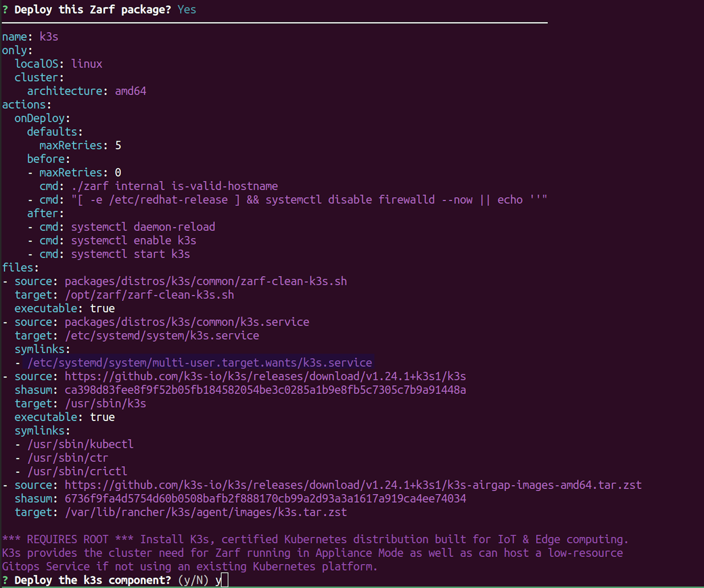

# Creating a K8s Cluster with Zarf

In this walkthrough, we will demonstrate how to use Zarf on a fresh Linux machine to deploy a [k3s](https://k3s.io/) cluster through Zarf's `k3s` component.

## System Requirements
-  `root` access on a Linux machine

:::info REQUIRES ROOT
The 'k3s' component requires root access when deploying as it will modify your host machine to install the cluster.
:::

## Prerequisites
- The [Zarf](https://github.com/defenseunicorns/zarf) repository cloned: ([`git clone` Instructions](https://docs.github.com/en/repositories/creating-and-managing-repositories/cloning-a-repository))
- Zarf binary installed on your $PATH: ([Install Instructions](../3-getting-started.md#installing-zarf))
- An init-package built/downloaded: ([init-package Build Instructions](./0-using-zarf-package-create.md)) or ([Download Location](https://github.com/defenseunicorns/zarf/releases))

## Walkthrough

1. Run the `zarf init` command as `root`.

```sh
$ zarf init
```

2. Confirm Package Deployment: <br/> 
- When prompted to deploy the package select `y` for Yes, then hit the `enter` key. <br/>

3. Confirm k3s Component Deployment: <br/>
- When prompted to deploy the k3s component select `y` for Yes, then hit the `enter` key.


:::tip
You can automatically accept the k3s component and confirm the package using the `--components` and `--confirm` flags.

```sh
$ zarf init --components="k3s" --confirm
```
:::

### Validating the Deployment
After the `zarf init` command is done running, you should see a k3s cluster running and a few `zarf` pods in the Kubernetes cluster.

```bash
zarf tools monitor

# Note you can press `0` if you want to see all namespaces and CTRL-C to exit
```
## Cleaning Up

The [`zarf destroy`](../4-user-guide/1-the-zarf-cli/100-cli-commands/zarf_destroy.md) command will remove all of the resources, including the k3s cluster, that was created by the initialization command.

```sh
zarf destroy --confirm
```