# Package Create Lifecycle

The following diagram shows the order of operations for the `zarf package create` command and the hook locations for [actions](../../examples/component-actions/README.md).

## `zarf package create`

```mermaid
graph TD
    A1(cd to directory with zarf.yaml)-->A2
    A2(load zarf.yaml into memory)-->A3
    A3(set package architecture if not provided)-->A4
    A4(filter components by architecture and flavor)-->A5
    A5(migrate deprecated component configs)-->A6
    A6(parse component imports)-->A7
    A7(process create-time variables)-->A8
    A8(process extensions)-->A9
    A9(remove duplicate images/repos if --differential flag used)-->A10
    A10(run validations)-->A11
    A11(confirm package create):::prompt-->A12

    subgraph Add Each Component
        A12(run each '.actions.onCreate.before'):::action-->A13(load '.charts')
        A13-->A14(load '.files')
        A14-->A15(load '.dataInjections')
        A15-->A16(load '.manifests')
        A16-->A17(load '.repos')
        A17-->A18(run each '.actions.onCreate.after'):::action
        A18-->A19{Success?}
        A19-->|Yes|A20(run each\n'.actions.onCreate.success'):::action
        A19-->|No|A999
    end

    A20-->A21(load all '.images')
    A21-->A22(generate SBOMs unless --skip-sbom flag was used)
    A22-->A23(cd back to original working directory)
    A23-->A24(archive components into tarballs)
    A24-->A25(generate checksums for all package files)
    A25-->A26(record package build metadata)
    A26-->A27(write the zarf.yaml to disk)
    A27-->A28(sign the package if a key was provided)
    A28-->A29{Output to OCI?}
    A29-->|Yes|A30(publish package to OCI registry)
    A29-->|No|A31(archive package into a tarball and write to disk)
    A30-->A32
    A31-->A32
    A32(write SBOM files to disk if --sbom or --sbom-out flags used)-->A33
    A33(view SBOMs if --sbom flag used)-->A34
    A34[Zarf Package Create Successful]:::success

    A999[Abort]:::fail

    classDef prompt fill:#4adede,color:#000000
    classDef action fill:#bd93f9,color:#000000
    classDef fail fill:#aa0000
    classDef success fill:#008000,color:#fff;
```

