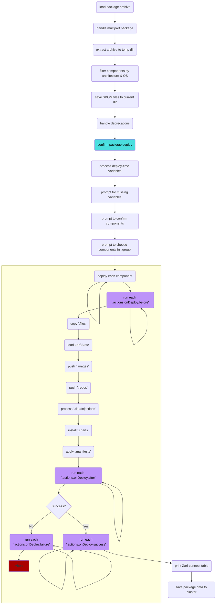

# Package Deploy Lifecycle

The following diagram shows the order of operations for the `zarf package deploy` command and the hook locations for [actions](../../examples/component-actions/README.md).

## `zarf package deploy`

