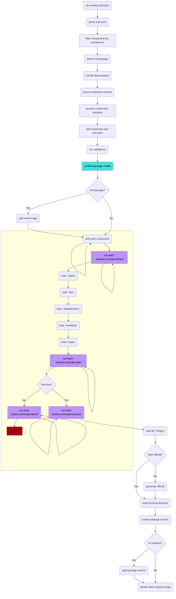
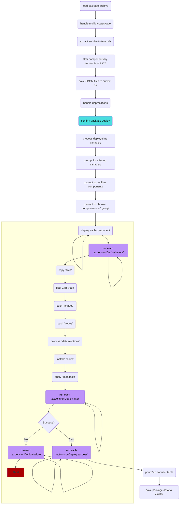

# Zarf Package Lifecycle

The following diagrams show the order of operations for the `zarf package` commands and the hook locations for [actions](../../examples/component-actions/README.md).

## `zarf package create`

## `zarf package deploy`

