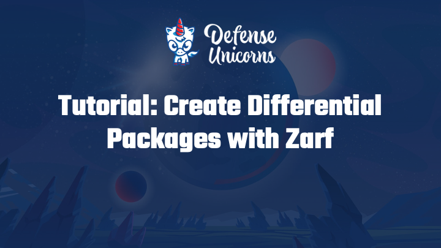

# Differential Packages with Zarf

## Introduction

In this tutorial, you will create a differential package using Zarf.  This is useful when multiple packages share common registries and container images.  That way those resources will only need to be packaged and deployed once.

## System Requirements

- Internet access to download resources or upload packages
- Access to a registry (this tutorial uses Docker Hub)

## Prerequisites

For following along locally, please ensure the following prerequisites are met:

- Zarf binary installed on your `$PATH`: ([Installing Zarf](../1-getting-started/index.md#installing-zarf))
- The [Zarf](https://github.com/defenseunicorns/zarf) repository cloned: ([`git clone` Instructions](https://docs.github.com/en/repositories/creating-and-managing-repositories/cloning-a-repository))

## Youtube Tutorial

## Create a Differential Package
In this example we're going to use the [Longhorn Example](../../examples/longhorn/) to create a differential package.

:::note

You'll notice we're not using a cluster in this example.  That's because this is feature of the Zarf CLI, and does not require a running cluster.

:::

1. From the examples/longhorn folder, Create the Zarf package with the `zarf package create` command.

<iframe src="/docs/tutorials/differential_package_create.html" width="100%" height="600px"></iframe>

2. Modify the zarf.yaml file to upgrade all of the 1.4.0 images to version 1.4.2, leave everything else the same.  

:::caution 

Don't forget to update the version of the package as well in the [metadata > version](/docs/create-a-zarf-package/zarf-schema#metadata) field. If you don't an attempt to create a differential package you'll get an error.

<iframe src="/docs/tutorials/differential_package_error.html" width="100%" height="180px"></iframe>

:::

<iframe src="/docs/tutorials/differential_package_edit.html" width="100%" height="600px"></iframe>

3. Use the `zarf package create` with the `--differential` flag.  This will build the differential package omitting, the images and repositories that are already present in zarf package you specify after the `--differential` flag.

<iframe src="/docs/tutorials/differential_package_create_differential.html" width="100%" height="600px"></iframe>

## Conclusion

You now have learned to create differenential packages with Zarf.  If you would like to see the size you saved.  You can use the `zarf package create` without the `--differential` flag.  You'll notice a size difference in the resulting files, as the all of the images are bundled into the much larger package.

<iframe src="/docs/tutorials/differential_package_create_conclusion.html" width="100%" height="600px"></iframe>

