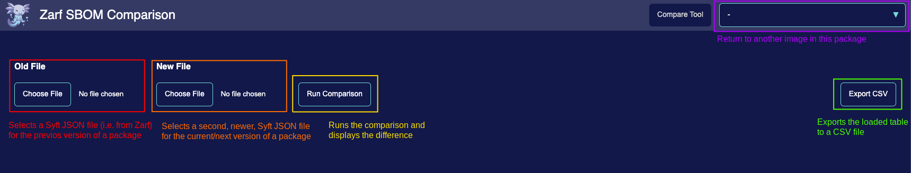

# SBOM Dashboard

A 'Software Bill of Materials' (SBOM) is a document that contains a detailed list of all the things a software application is using. SBOMs are important from a security standpoint because they allow you to better track what dependencies you have, and with that information you can quickly check if any of your dependencies are out of date or have a known vulnerability that should be patched. Zarf makes SBOMs easier, if not painless, to deal with!

## SBOMs Built Into Packages
Zarf treats security as a first class concern and builds SBOM capabilities into packages by default! Unless explicitly skipped with the `--skip-sbom` flag, whenever a package is created, Zarf generates an SBOM for it and adds it into the package itself. This means that wherever you end up moving your package to, you will always be able to take a peek inside to see what it contains. All of the package's sbom information exists within a `sboms` directory at the root of the zarf package tarball.

You can view these files by decompressing the package tarball and navigating to the `sboms` directory or by running `zarf package inspect <your-package.tar.zst> --sbom-out <directory-to-place-sboms-in>`. If there are any images or files included in the package definition, the `sboms` directory will contain a `.html` and `.json` file for each image or set of files. Both of these files contain the same information, but the `.html` files are a lightweight representation of the `.json` SBOM files to be more human readable.  The `.json` files exist to be injected into other tools, such as [Grype](https://github.com/anchore/grype) for vulnerability checking as an example.

``` bash
zarf package inspect zarf-package-example-amd64.tar.zst --sbom-out ./temp-sbom-dir
cd ./temp-sbom-dir/example
ls
```

If you would like to get to any of this intormation without messing with the raw files you can also run package inspect with the `-s` or `--sbom` flag to quickly open a browser to the viewer:

``` bash
zarf package inspect zarf-package-example-amd64.tar.zst --sbom
```

<br />

## Viewing SBOMs When Deploying

:::note
Zarf does not prompt you to view the SBOM if you are deploying a package with the `--confirm` flag
:::

When deploying a package, Zarf will output the yaml definition of the package, i.e. the zarf.yaml file that defined the package that was created. If there are any artifacts included in the package, Zarf will also output a note saying how many artifacts are going to be deployed with a link to a lightweight html viewer that you can use to get a visual overview of the artifacts and what they contain.

**Example SBOM Prompt**


You can navigate to the SBOM viewer dashboard by copying the `.html` file into your browser. Through the simple dashboard you can see all of the contents for each container image or component within your package. You can toggle through the different images or components in the dropdown at the top right of the dashboard as well as export the table contents to a CSV.

**Example SBOM Dashboard**


The SBOM viewer also has an SBOM comparison tool built in that you can access by clicking the "Compare Tool" button next to the image selector.  This view allows you to take the SBOM JSON data (extracted alongside the HTML files) and compare that across images or packages (if you extract multiple at a time).  This is useful for seeing what has changed between different image or component versions.

**Example SBOM Comparer**

