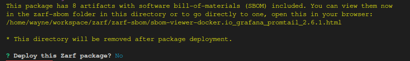
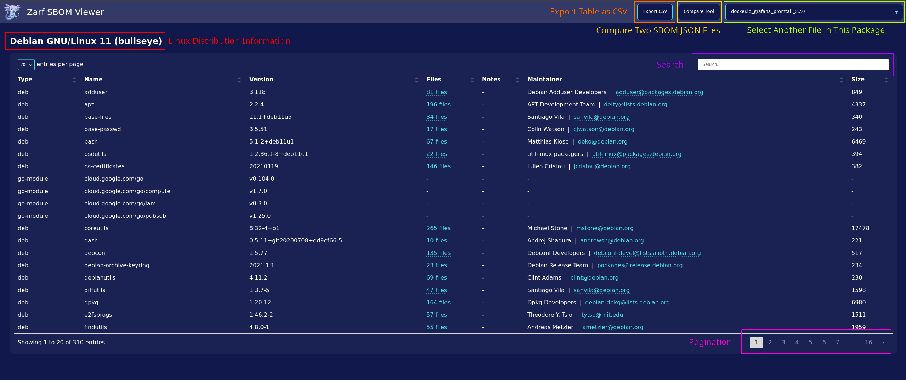

# SBOM Dashboard

A 'Software Bill of Materials' (SBOM) is a document that contains a detailed list of all the things a software application is using. SBOMs are important from a security standpoint because they allow you to better track what dependencies you have, with that information you can quickly check if any of your dependencies are out of date or have a known vulnerability that should be patched. Zarf makes SBOMs easier, if not painless, to deal with!


## SBOMs Built Into Packages
Zarf treats security as a first class concern and builds SBOM capabilities into packages by default! Unless explicitly skipped with the `--skip-sbom` flag, whenever a package is created, Zarf generates an SBOM for it and adds it into the package itself. This means that wherever you end up moving your package to, you will always be able to take a peek inside to see what it contains. All of the packages sbom information exists within a `sboms` directory at the root of the tarball.

You can view these files by decompressing the package tarball and navigating to the `sboms` directory. If there are any containers included in the package definition, the `sboms` directory will contain a `.html` and .`.json` file for each container. Both of these files contain the same information but the `.html` files are a lightweight representation of the SBOM and the `.json` files in a more human readable format.
``` bash
zarf tools archiver decompress my-zarf-package.tar.zst ./temp-decompressed-dir
cd ./temp-decompressed-dir/sboms
ls
```

<br />

## Viewing SBOMs When Deploying
:::note
Zarf does not prompt you to view the SBOM if you are deploying a package with the `--confirm` flag
:::
When deploying a package, Zarf will output the yaml definition of the package, the zarf.yaml file that defined the package that got created. If there are any containers included in the package, Zarf will also output a note saying how many images are going to be getting deployed and links to a lightweight html viewer that you can use to get a visual overview of the images and what they contain.

**Example SBOM Prompt**



You can navigate to the SBOM viewer dashboard by copying the `.html` file into your browser. Through the simple dashboard you can see all of the contents for each container image within your package. You can toggle through the different images in the dropdown at the top right of the dashboard.

<!-- TODO: I would like to annotate this png with colored boxes/text to describe different parts of the dashboard -->
**Example SBOM Dashboard**

