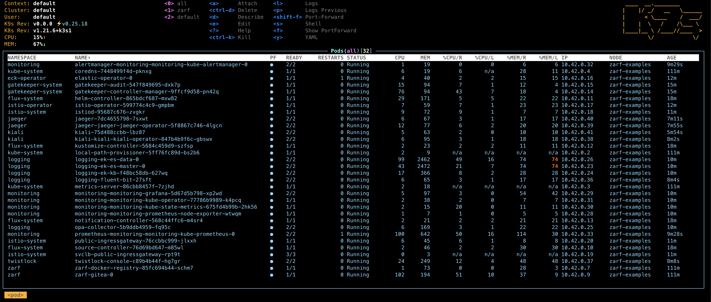

# Example: Big Bang Core

This example shows a deployment of [Big Bang Core](https://repo1.dso.mil/platform-one/big-bang/bigbang) using Zarf.




## Known Issues

- Inside the Vagrant VM the services are available on the standard port `443`. Outside the VM if you want to pull something up in your browser that traffic is being routed to port `8443` to avoid needing to be root when running the Vagrant box.
- Due to issues with Elasticsearch this example doesn't work yet in some distros. It does work in the Vagrant VM detailed below. Upcoming work to update to the latest version of Big Bang and swap the EFK stack out for the PLG stack (Promtail, Loki, Grafana) should resolve this issue
- Currently this example does the equivalent of `kustomize build | kubectl apply -f -`, which means Flux will be used to deploy everything, but it won't be watching a Git repository for changes. Upcoming work is planned to update the example so that you will be able to open up a Git repo in the private Gitea server inside the cluster, commit and push a change, and see that change get reflected in the deployment.

## Prerequisites

1. Install [Vagrant](https://www.vagrantup.com/)
1. Install `make`
1. Install `sha256sum` (on Mac it's `brew install coreutils`)

## Instructions

### Pull down the code and binaries

```shell
# clone the binaries
git clone https://github.com/defenseunicorns/zarf.git

# change to the examples folder
cd zarf/examples

# Download the latest release of Zarf and the Init Package to the 'examples/sync' folder
make fetch-release
```

> NOTE:
>
> If you have any issues with `make fetch-release` you can try `make build-release` instead. It will build the files instead of downloading them. You'll need Golang installed.

### Build the deploy package

```shell
# Create the deploy package and move it to the 'examples/sync' folder
make package-example-big-bang
```

### Start the Vagrant VM

```shell
# Start the VM. You'll be dropped into a shell in the VM as the Root user
make vm-init
```

> NOTE:
>
> All subsequent commands should be happening INSIDE the Vagrant VM

### Initialize Zarf

```shell
# Initialize Zarf
./zarf init --confirm --components k3s,gitops-service

# (Optional) Inspect the results
./zarf tools k9s
```

### Deploy Big Bang

```shell
# Deploy Big Bang
./zarf package deploy --confirm zarf-package-big-bang-core-demo-amd64.tar.zst

# (Optional) Inspect the results
./zarf tools k9s
```

### Clean Up

```shell
# Inside the VM
exit

# On the host
make vm-destroy
```

## Services

| URL                                                   | Username  | Password                                                                                                                                                                                   | Notes                                                               |
| ----------------------------------------------------- | --------- | ------------------------------------------------------------------------------------------------------------------------------------------------------------------------------------------ | ------------------------------------------------------------------- |
| [AlertManager](https://alertmanager.bigbang.dev:8443) | n/a       | n/a                                                                                                                                                                                        | Unauthenticated                                                     |
| [Grafana](https://grafana.bigbang.dev:8443)           | `admin`   | `prom-operator`                                                                                                                                                                            |                                                                     |
| [Kiali](https://kiali.bigbang.dev:8443)               | n/a       | `kubectl get secret -n kiali -o=json \| jq -r '.items[] \| select(.metadata.annotations."kubernetes.io/service-account.name"=="kiali-service-account") \| .data.token' \| base64 -d; echo` |                                                                     |
| [Kibana](https://kibana.bigbang.dev:8443)             | `elastic` | `kubectl get secret -n logging logging-ek-es-elastic-user -o=jsonpath='{.data.elastic}' \| base64 -d; echo`                                                                                |                                                                     |
| [Prometheus](https://prometheus.bigbang.dev:8443)     | n/a       | n/a                                                                                                                                                                                        | Unauthenticated                                                     |
| [Jaeger](https://tracing.bigbang.dev:8443)            | n/a       | n/a                                                                                                                                                                                        | Unauthenticated                                                     |
| [Twistlock](https://twistlock.bigbang.dev:8443)       | n/a       | n/a                                                                                                                                                                                        | Twistlock has you create an admin account the first time you log in |

## Troubleshooting

### Elasticsearch isn't working when I try to deploy the Big Bang package on KinD (or K3d, or any other distro other than K3s)
That's a known issue. This example is only supported right now when using the K3s cluster that Zarf is able to deploy when running `zarf init`. Updating to the latest version of Big Bang and swapping the EFK stack out for the PLG stack should fix this issue. It's on the roadmap™.
### I'm getting "Misdirected Request" when trying to get to any of the services in my browser
Run the `kubectl delete` command documented above to delete the buggy EnvoyFilter. Updating to the latest version of Big Bang will fix this issue. It's on the roadmap™.

### My computer crashed!
Close all those hundreds of chrome tabs, shut down all non-essential programs, and try again. Big Bang is a HOG. If you have less than 32GB of RAM you're in for a rough time.
