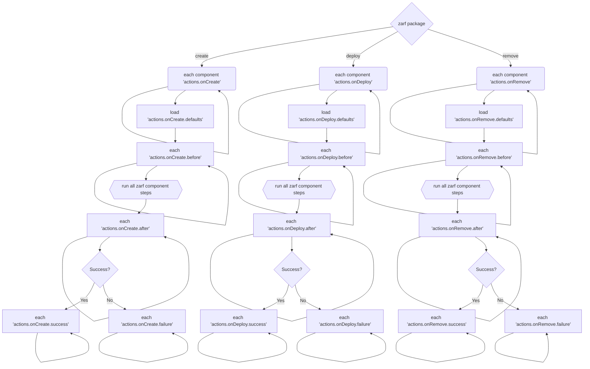

# Component Actions

:::note

Component Actions have replaced Component Scripts. Zarf will still read scripts entries, but will convert them to actions. Component Scripts will be removed in a future release.

:::

This example demonstrates how to define actions within your package that can run either on `zarf package create`, `zarf package deploy` or `zarf package remove`.  These actions will be executed with the context that the Zarf binary is executed with.

## Lifecycle of component actions

Provided a `zarf package <COMMAND>`, the following diagram shows the lifecycle of component actions:



## Prepare Scripts

`prepare` scripts run on `zarf package create` and allow a package creator to retrieve or manipulate files that they want to include in their Zarf package.  For example if you have a large data file that you need to include in your package you could include something like the following (replacing the url as needed):


```
components:
- name: prepare-example
  scripts:
    prepare:
    - wget https://download.kiwix.org/zim/wikipedia_en_100.zim
```

## Before Scripts

`before` scripts run on `zarf package deploy` and allow a package to execute commands _before_ the component is deployed into the cluster.  For example if you needed to create a infrastructure resources before a deployment:

```
components:
- name: before-example
  scripts:
    before:
    - "./eksctl create cluster -f eks.yaml"
```

## After Scripts

`after` scripts run on `zarf package deploy` and allow a package to execute commands _after_ the component is deployed into the cluster. For example if you need to cleanup resources that were temporarily created during deployment:

```
components:
- name: prepare-example
  scripts:
    after:
    - "rm my-temp-file.txt"
```

:::note

Any binaries you execute in your actions must exist on the machine they are executed on.

:::
