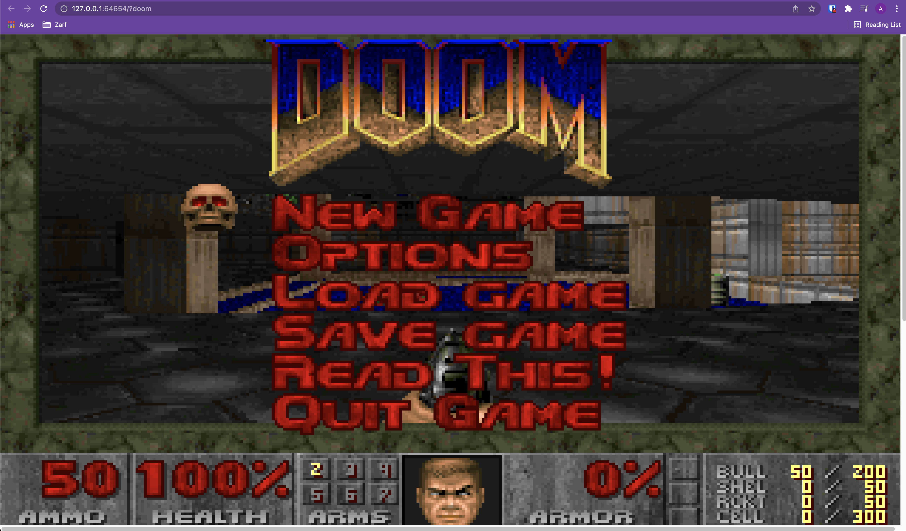

# Zarf Composable Packages Example

This example demonstrates using Zarf to compose existing zarf packages into another package.

More specifically, you'll be running the zarf game example by simply adding an import and path in the new [zarf.yaml](zarf.yaml).

> _**Note**_
>
> In this example there is no "GitOps" service&mdash;Zarf is only showing off it's ability to act as a standard means of packaging, distribution, and runtime.

&nbsp;


## The Flow


Here's what you'll do in this example:

1. [Get ready](#get-ready)

1. [Create a cluster](#create-a-cluster)

1. [Package the game](#package-the-game)

1. [Deploy it](#deploy-it)

1. [Space marine the demon invasion!](#space-marine-the-demon-invasion)

1. [Cleanup](#cleanup)

&nbsp;


## Get ready


Before the magic can happen you have to do a few things:

1. Install [Docker](https://docs.docker.com/get-docker/). Other container engines will likely work as well but aren't actively tested by the Zarf team.

1. Install [KinD](https://github.com/kubernetes-sigs/kind). Other Kubernetes distros will work as well, but we'll be using KinD for this example since it is easy and tested frequently and thoroughly.

1. Clone the Zarf project &mdash; for the example configuration files.

1. Download a Zarf release &mdash; you need a binary _**and**_ an init package, [here](../../docs/workstation.md#just-gimmie-zarf).

1. (Optional) Log `zarf` into Iron Bank if you haven't already &mdash; instructions [here](../../docs/ironbank.md#2-configure-zarf-the-use-em). Optional for this specific example since the container comes from GitHub rather than Iron Bank but a good practice and needed for most of the other examples.

1. (Optional) Put `zarf` on your path &mdash; _technically_ optional but makes running commands simpler. Make sure you are picking the right binary that matches your system architecture. `zarf` for x86 Linux, `zarf-mac-intel` for x86 MacOS, `zarf-mac-apple` for M1 MacOS.

&nbsp;


## Create a cluster

You can't run software without _somewhere to run it_, so the first thing to do is create a local Kubernetes cluster that Zarf can deploy to. In this example we'll be using KinD to create a lightweight, local K8s cluster running in Docker.

Kick that off by running this command:

```sh
kind create cluster
```

This will result in a single-node Kubernetes cluster called `kind-kind` on your local machine running in Docker. Your KUBECONFIG should be automatically configured to talk to the new cluster.

```sh
cd <same dir as zarf-init.tar.zst>
zarf init
```

Follow the prompts, answering "no" to each of the optional components, since we don't need them for this deployment.

Congratulations!  Your machine is now running a single-node Kubernetes cluster powered by Zarf!

 > _**Note**_
 >
 > Zarf supports non-interactive installs too! Give `zarf init --confirm --components logging` a try next time.

**Troubleshooting:**

> _**ERROR:  Unable to find the package on the local system, expected package at zarf-init.tar.zst**_
>
> The zarf binary needs an init package to know how to setup your cluster! So, if `zarf init` returns an error like this:
> ```sh
> ERROR:  Unable to find the package on the local system, expected package at zarf-init.tar.zst
> ```
> It's likely you've either forgotten to download `zarf-init.tar.zst` (as part of [getting ready](#get-ready)) _**OR**_ you are _not_ running `zarf init` from the directory the init package is sitting in.

> _**ERROR: failed to create cluster: node(s) already exist for a cluster with the name "kind"**_
>
> You already have a KinD cluster running. Either just move on to use the current cluster, or run `kind delete cluster`, then `kind create cluster`.

> _**Cannot connect to the Docker daemon at unix:///var/run/docker.sock. Is the docker daemon running?**_
>
> Docker isn't running or you're otherwise not able to talk to it. Check your Docker installation, then try again.

&nbsp;


## Package the Composed Example


Zarf is (at heart) a tool for making it easy to get software from _where you have it_ to _**where you need it**_&mdash;specifically, across an airgap. Since moving bits is so core to Zarf the idea of a "ready-to-move group of software" has a specific name&mdash;the _package_.

All of the software a Zarf cluster runs is installed via package&mdash;for many reasons like versioning, auditability, etc&mdash;which means that if you want to run _**Doom**_ in your cluster you're going to have to build a package for it.

Luckily, this is very easy to do&mdash;package contents are defined by simple, declarative yaml files and _we've already made one for you_. To build the game package you simply:

```sh
cd <zarf dir>/examples/composable-packages    # directory with zarf.yaml, and
zarf package create --confirm   # make the package
```

Watch the terminal scroll for a while. Once things are downloaded & zipped up and you'll see a file ending in `.tar.zst` drop.  _That's_ your package.

&nbsp;


## Deploy it


It's time to feed the package you built into your cluster.

```sh
zarf package deploy ./zarf-package-compose-example.tar.zst --confirm
```

In a couple seconds the cluster will have loaded your package.

&nbsp;

## Space marine the demon invasion!

After the deploy has completed, a prompt would have displayed the new connect commands you can use to connect automatically bring up the game in your browser. Running the command `zarf connect games` should open your browser to `http://localhost:<SOME_PORT>` and be greeted by a short catalog of games to play. Run `zarf connect doom` to directly open the _**Doom**_ game. We use `zarf connect` here so we can connect to it in a browser without needing a Kubernetes Ingress Controller, which is a more advanced topic and has different configurations depending on which controller and which distribution of Kubernetes you are using.

Once you see the ultra-iconic title screen, you're ready to go (save the world)!



&nbsp;

## Cleanup


Once you've had your fun it's time to clean up.

In this case, since the Zarf cluster was installed specifically (and _only_) to serve this example, clean up is really easy&mdash;you just tear down the entire cluster:

```sh
kind delete cluster
```

It only takes a couple moments for the _entire cluster_ to disappear&mdash;long-running system services and all&mdash;leaving your machine ready for the next adventure.

&nbsp;

---

&nbsp;

### Credits

:sparkles: Special thanks to these fine references! :sparkles:

- https://www.reddit.com/r/programming/comments/nap4pt/dos_gaming_in_docker/

- https://earthly.dev/blog/dos-gaming-in-docker/
