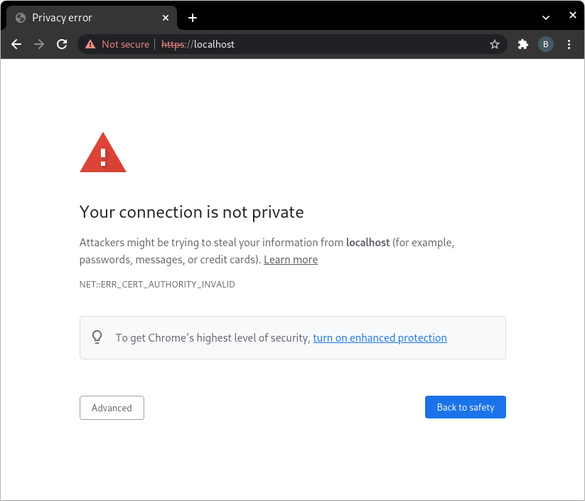
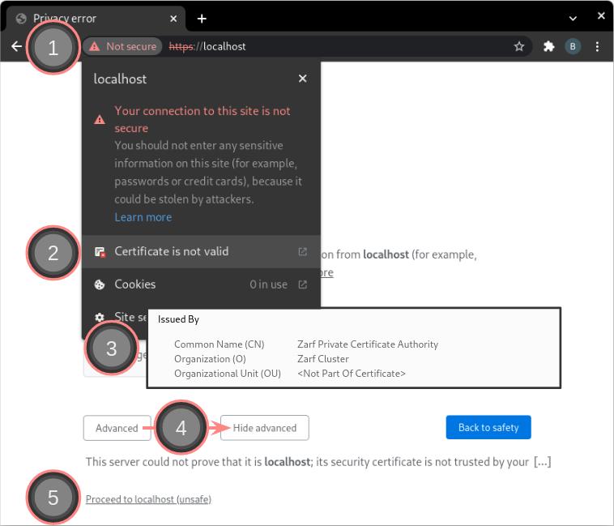
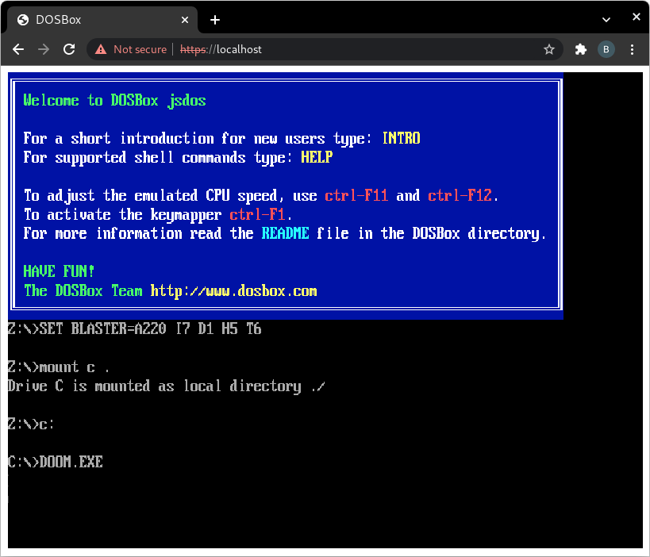

# Zarf Game Example - Doom in the Cluster!

This example demonstrates using Zarf to kill time (and evil).

More specifically, you'll be running a copy of the 1993, mega-hit video game _**Doom**_ in a Zarf-installed Kubernetes (k8s) cluster&mdash;_right on your local machine_.

> _**Note**_
>
> In this example there is no "GitOps" service&mdash;Zarf is only showing off it's ability to act as a standard means of packaging, distribution, and runtime.

&nbsp;


## The Flow

<a href="https://asciinema.org/a/444679?x-scenario=examples-game-scripted&autoplay=1">

</a>

Here's what you'll do in this example:

1. [Get ready](#get-ready)

1. [Create a cluster](#create-a-cluster)

1. [Package the game](#package-the-game)

1. [Deploy it](#deploy-it)

1. [Space marine the demon invasion!](#space-marine-the-demon-invasion)

1. [Cleanup](#cleanup)

&nbsp;


## Get ready

<a href="https://asciinema.org/a/444679?x-scenario=examples-game-scripted&t=1">

</a>

Before the magic can happen you have to do a few things:

1. Get a "root" shell &mdash; `zarf` needs power to install stuff / bind ports / etc.

1. Clone the Zarf project &mdash; for the example configuration files.

1. Download a Zarf release &mdash; you need a binary _**and**_ an init package, [here](../../docs/workstation.md#just-gimmie-zarf).

1. Log `zarf` into Iron Bank if you haven't already &mdash; instructions [here](../../docs/ironbank.md#2-configure-zarf-the-use-em).

1. Put `zarf` on your path &mdash; _technically_ optional but makes running commands simpler.

&nbsp;


## Create a cluster

<a href="https://asciinema.org/a/444679?x-scenario=examples-game-scripted&t=48">

</a>

You can't run software without _somewhere to run it_, so the first thing to do is have `zarf` install & run a new, local k8s cluster&mdash;the "Zarf cluster".

Kick that off by _moving into the directory with your init package_ and running this command:

```sh
cd <same dir as zarf-init.tar.zst>
zarf init
```

Answer the follow-on prompts as appropriate for your machine configuration & give it a few seconds to run.

Congratulations!  Your machine is now a single node k8s cluster!

 > _**Note**_
 >
 > Zarf supports fire-and-forget installs too! Give `zarf init --help` a call for more details on that.

> _**Error &mdash; missing or unreadable package**_
>
> The zarf binary needs an init package to know how to setup your cluster! So, if `zarf init` returns an error like this:
> ```sh
> FATA[0004] The package archive seems to be missing or unreadable.  archive=zarf-init.tar.zst
> ```
> It's likely you've either forgotten to download `zarf-init.tar.zst` (as part of [getting ready](#get-ready)) _**OR**_ you are _not_ running `zarf init` from the directory the init package is sitting in.

&nbsp;


## Package the game

<a href="https://asciinema.org/a/444679?x-scenario=examples-game-scripted&t=80">

</a>

Zarf is (at heart) a tool for making it easy to get software from _where you have it_ to _**where you need it**_&mdash;specifically, across an airgap. Since moving bits is so core to Zarf the idea of a "ready-to-move group of software" has a specific name&mdash;the _package_.

All of the software a Zarf cluster runs is installed via package&mdash;for many reasons like versioning, auditability, etc&mdash;which means that if you want to run _**Doom**_ in your cluster you're going to have to build a package for it.

Luckily, this is very easy to do&mdash;package contents are defined by simple, declarative yaml files and _we've already made one for you_. To build the game package you simply:

```sh
cd <zarf dir>/examples/game     # directory with zarf.yaml, and
zarf package create             # make the package
```

Answer the questions & watch the terminal scroll for a while. Once things are downloaded & zipped up and you'll see a file ending in `.tar.zst` drop.  _That's_ your package.

&nbsp;


## Deploy it

<a href="https://asciinema.org/a/444679?x-scenario=examples-game-scripted&t=111">

</a>

It's time to feed the package you built into your cluster.

> _**Note**_
>
> If you were an evil genius trying to get _**Doom**_ to run in your internet-isolated, evil underground super-base _this_ is where you would burn the zarf release + game package to removable media for shipment "across the airgap"... probably via evil FedEx.

Since you're running a Zarf cluster directly on your local machine&mdash;where the game package & `zarf` binary _already are_&mdash;deploying the game is very simple:

```sh
zarf package deploy
```

Respond as appropriate and in a couple seconds the cluster will have loaded your package.

> _**Important**_
>
> It's possible to try a package deploy _before the Zarf cluster is ready to receive it_. If you see an error like `"https://<cluster ip>/v2/": dial tcp ,<cluster ip>:443: connect: connection refused;` then it's very likely that you've beat the Zarf startup routines.
>
> The fix is simple: just wait for the cluster to finish starting & try again.

&nbsp;


## Space marine the demon invasion!

<a href="../../.images/get-started/not-private.png">

</a>

Navigate your browser to `https://localhost` and be greeted by... a "Privacy error"? What's that about?!

### Privacy error

Long-story-short, **it's a false alarm**&mdash;your connection _is_ private and _no one_ is trying steal your information.

Long-story-long, your browser is showing you this because a bare bones, default install of Zarf **generates its own certificate authority (CA)** during install, which it then uses to create certificates to back `https` requests.

The certificates generated by this CA&mdash;and used to secure Zarf cluster services&mdash;are perfectly reasonably, secure certificates, it's just that your browser does not recognize the recently-generated CA and so warns you.

>_**Further reading**_
>
> If you're interested in this "trusted certificates" + "https" thing, the internet abounds with resources&mdash;this [wikipedia article](https://en.wikipedia.org/wiki/Self-signed_certificate) is a great place to start.

&nbsp;

### Proceed anyway

<a href="../../.images/get-started/not-private-verify.png">

</a>

With an understanding of _why there is no danger here_, you can proceed to the example after some one-time (per Zarf cluster) browser "risk" acceptance:

1. Click the "Not secure" warning (at the left of the location bar) to view the site security information.

1. Click the "Certificate is not valid" row to show the certificate information popup.

1. Verify the certificate has:

    - an "Issued By" block showing the **Zarf Private Certificate Authority** issuer, and

    - a "Validity Period" block showing that the certificate is not expired.

    Once you're comfortable with the Zarf certificate, you can close the certificate popup.

1. To tell the browser that _you trust the Zarf-issued certificate_, click the "Advanced" button to show the advanced options, and then

1. Click the "Proceed to localhost" link.

Now&mdash;in this and all future requests to this URL&mdash;you'll be taken directly to the example service.

&nbsp;

### It begins!

<a href="../../.images/get-started/dosbox.png">

</a>

Give the example a couple of seconds to "boot up".

Once you see the ultra-iconic title screen, you're ready to go (save the world)!

&nbsp;

> _**Note**_
>
> The images / steps described here are for Chrome but all major, modern browsers will have a similar security mechanism and associated workaround.

&nbsp;


## Cleanup

<a href="https://asciinema.org/a/444679?x-scenario=examples-game-scripted&t=162">

</a>

Once you've had your fun it's time to clean up.

In this case, since the Zarf cluster was installed specifically (and _only_) to serve this example, clean up is really easy&mdash;you just tear down the entire cluster:

```sh
zarf destroy
```

It only takes a couple moments for the _entire Zarf cluster_ to disappear&mdash;long-running system services and all&mdash;leaving your machine ready for the next adventure.

&nbsp;

---

&nbsp;

### Credits

:sparkles: Special thanks to these fine references! :sparkles:

- https://www.reddit.com/r/programming/comments/nap4pt/dos_gaming_in_docker/

- https://earthly.dev/blog/dos-gaming-in-docker/
