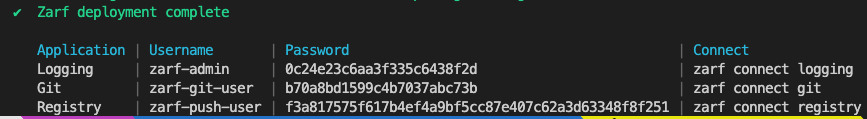

# Zarf Components - Add Logging

This example demonstrates using a Zarf component to inject zero-config, centralized logging into your Zarf cluster.

More specifically, you'll be adding a [Promtail / Loki / Grafana (PLG)](https://github.com/grafana/loki) stack to the example game cluster by installing Zarf's "logging" component.

&nbsp;

## The Flow

Here's what you'll do in this example:

1. [Get ready](#get-ready)

1. [Install the logging component](#install-the-logging-component)

1. [Note the credentials](#note-the-credentials)

1. [Check the logs](#check-the-logs)

1. [Cleanup](#cleanup)

&nbsp;

&nbsp;


## Get ready

This scenario builds upon the previous one, so:

1. Run through the [Zarf game example](./README.md) but stop when you're told to run `zarf init`

1. Take a deep breath&mdash;because it's good for your body&mdash;and read on!

&nbsp;

&nbsp;

## Install the logging component

Installing a Zarf component is _really_ easy&mdash;you just have to let `zarf init` know that you want use it.  That's it!

Exactly like when you first created the game example cluster, you _move into the directory holding your init package_ and run:

```sh
cd <same dir as zarf-init-<arch>.tar.zst>
zarf init
```

You can answer the follow-on prompts in almost the exact same way as during your original install _**except** this time answer "yes" when asked whether to install the "logging" component_.

Give it some time for the new logging pods to come up and you're ready to go!

 > _**Note**_
 >
 > Zarf supports non-interactive installs too! See `zarf init --help` for how to make that work.

&nbsp;

## Note the credentials

Go back to your terminal and review the `zarf init` command output&mdash;the very last thing printed should be a set of credentials Zarf has generated for you.

Pay attention to these because you're going to need them to log into your shiny, new [Grafana](https://grafana.com/docs/) installation.

The line you want will look something like this:



The ones under "Logging" are what you'll need.

&nbsp;


## Check the logs

We've only _just_ installed the logging utilities so we (likely) haven't had time to record anything interesting. Since log aggregation & monitoring aren't worth much without something to collect, let's get some data in there.

&nbsp;

### Generate some traffic

Deploy the Game example again, then pull up the game in your brower&mdash;_[instructions here](./README.md#space-marine-the-demon-invasion), in case you forgot how_&mdash;and then reload the browser window a few times.

Doing that sends a bunch of HTTP traffic into the cluster & should give you something worth looking at in Grafana.

&nbsp;


### Get into Grafana

Now that you've got some logs worth looking at, you're ready to log into your brand new Grafana instance.

Get started by opening Grafana using `zarf connect logging`

You'll be redirected the `/login` page where you have to sign in with the Grafana credentials you saved [in a previous step](#note-the-credentials).

Once you've successfully logged in go to:

1. The "Explore" page (Button on the left that looks like a compass)

1. you can select `Loki` in the dropdown, and then

1. enter `{app="game"}` into the Log Browser query input field

Submit that query and you'll get back a dump of all the game pod logs that Loki has collected. Neat!

&nbsp;


## Cleanup

Once you've had your fun it's time to clean up.

In this case, since the Zarf cluster was installed specifically (and _only_) to serve this example, clean up is really easy&mdash;you just tear down the entire cluster:

```sh
kind delete cluster
```

It takes just a couple moments for the _entire cluster_ to disappear&mdash;long-running system services and all&mdash;leaving your machine squeaky clean.
