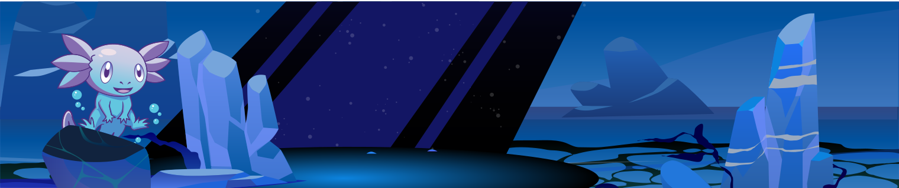

import { LinkCard } from "@astrojs/starlight/components";

Zarf is a free and open-source tool that enables _**declarative creation & distribution of software into air-gapped/constrained/standalone environments**_.

Zarf provides a way to package and deploy software in a way that is **repeatable**, **secure**, and **reliable**.

 

<LinkCard title="Getting Started with Zarf" href="/getting-started/install" />

## Why Use Zarf?

- 💸 **Free and Open-Source.** Zarf will always be free to use and maintained by the open-source community.
- ⭐️ **Zero Dependencies.** As a statically compiled binary, the Zarf CLI has zero dependencies to run on any machine.
- 🔓 **No Vendor Lock.** There is no proprietary software that locks you into using Zarf. If you want to remove it, you still can use your helm charts to deploy your software manually.
- 💻 **OS Agnostic.** Zarf supports numerous operating systems. A full matrix of supported OSes, architectures and featuresets is coming soon.
- 📦 **Highly Distributable.** Integrate and deploy software from multiple secure development environments including edge, embedded systems, secure cloud, data centers, and even local environments.
- 🚀 **Develop Connected, Deploy Disconnected.** Teams can build and configure individual applications or entire DevSecOps environments while connected to the internet. Once created, they can be packaged and shipped to a disconnected environment to be deployed.
- 💿 **Single File Deployments.** Zarf allows you to package the parts of the internet your app needs into a single compressed file to be installed without connectivity.
- ♻️ **Declarative Deployments.** Zarf packages define the precise state for your application enabling it to be deployed the same way every time.
- 🦖 **Inherit Legacy Code.** Zarf packages can wrap legacy code and projects - allowing them to be deployed to modern DevSecOps environments.

{/* mirrored from the project's README.md */}

### 📦 Out of the Box Features

- Automate Kubernetes deployments in disconnected environments
- Automate [Software Bill of Materials (SBOM)](./3-create-a-zarf-package/6-package-sboms.md) generation
- Build and [publish packages as OCI image artifacts](./5-zarf-tutorials/7-publish-and-deploy.md)
- Provide a [web dashboard](./4-deploy-a-zarf-package/4-view-sboms.md) for viewing SBOM output
- Create and verify package signatures with [cosign](https://github.com/sigstore/cosign)
- [Publish](./2-the-zarf-cli/100-cli-commands/zarf_package_publish.md), [pull](./2-the-zarf-cli/100-cli-commands/zarf_package_pull.md), and [deploy](./2-the-zarf-cli/100-cli-commands/zarf_package_deploy.md) packages from an [OCI registry](https://opencontainers.org/)
- Powerful component lifecycle [actions](./3-create-a-zarf-package/7-component-actions.md)
- Deploy a new cluster while fully disconnected with [K3s](https://k3s.io/) or into any existing cluster using a [kube config](https://kubernetes.io/docs/concepts/configuration/organize-cluster-access-kubeconfig/)
- Builtin logging stack with [Loki](https://grafana.com/oss/loki/)
- Builtin Git server with [Gitea](https://gitea.com/)
- Builtin Docker registry
- Builtin [K9s Dashboard](https://k9scli.io/) for managing a cluster from the terminal
- [Mutating Webhook](adr/0005-mutating-webhook.md) to automatically update Kubernetes pod's image path and pull secrets as well as [Flux Git Repository](https://fluxcd.io/docs/components/source/gitrepositories/) URLs and secret references
- Builtin [command to find images](./2-the-zarf-cli/100-cli-commands/zarf_dev_find-images.md) and resources from a Helm chart
- Tunneling capability to [connect to Kubernetes resources](./2-the-zarf-cli/100-cli-commands/zarf_connect.md) without network routing, DNS, TLS or Ingress configuration required

### 🛠️ Configurable Features

- Customizable [variables and package templates](/ref/examples/variables/) with defaults and user prompting
- [Composable packages](/ref/components/#component-imports) to include multiple sub-packages/components
- Component-level OS/architecture filtering

:::tip

To quickly try out Zarf for yourself see the [Zarf Quick Start](/getting-started)!

:::
