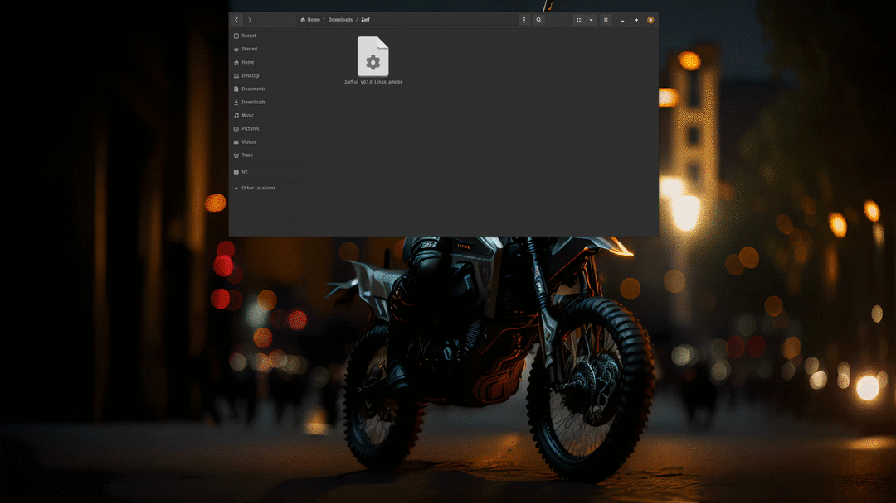
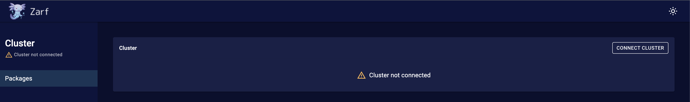

:::caution

The Zarf Deployment Web UI is deprecated and will be removed in a future release. Please use the [Zarf CLI](/commands/zarf) for all Zarf operations.

:::

Zarf is also available in a version that exposes a Deployment Web UI that supports a number of Zarf features used during the package deployment process. For users who prefer not to use the command line tool, the Web UI creates a simple experience to deploy and manage Zarf clusters and packages. The Web UI can be used to connect to existing clusters (via a Kubeconfig), initialize a cluster, deploy packages into a cluster, update packages in the cluster, and remove packages from the cluster.

The Zarf Web UI mirrors the functionality of the Zarf CLI commands, but with a more intuitive flow and familiar web application patterns for non-technical users. The web UI does not offer any additional commands or core functionality to Zarf.

## Open the Zarf Deployment Web UI

The Zarf Deployment Web UI can easily be downloaded from the [Zarf UI Github Project](https://github.com/zarf-dev/zarf-ui/releases/latest).

Follow these steps to get started using the Web UI

1. Step one: [Download the Zarf UI](https://github.com/zarf-dev/zarf-ui/releases/latest) version that matches your system (i.e. `zarf-ui_v0.1.0-Darwin_arm64`)
2. Step two: (if applicable) Mark the file as executable with `chmod +x zarf-ui_v0.1.0-Darwin_arm64`
3. Step three: Run the binary with `./zarf-ui_v0.1.0-Darwin_arm64` or by double clicking the file in your file browser

## Using the Zarf Deployment Web UI

### Cluster Connection Status

When Zarf UI is running it automatically searches for a Kubeconfig on the local machine. If the Kubeconfig is found, it searches the default cluster to determine if it is a Zarf cluster (i.e. initialized). There are two different cluster statuses the Web UI will display based on the state of the cluster found.

#### Cluster not Connected (Not Initialized)

1. Shown when there is no Kubeconfig found on the machine.
2. Shown when a Kubeconfig is found on the machine, but Zarf has not been deployed and set up in the cluster.

#### Cluster Connected (Initialized)

If Zarf finds a cluster in the Kubeconfig that has Zarf resources in it it will automatically connect to the cluster and display the cluster details on the Web UI.

1. Shown when there is a Kubeconfig found on the machine with a default cluster that has Zarf resources in it.

### Connect to Existing Cluster

The Zarf Web UI makes connecting to existing clusters easy. When on the packages page, if there is no Zarf cluster currently connected, select the connect cluster button. If Zarf finds a Kubeconfig it will ask the user if they want to connect to the default cluster context.

:::tip

Zarf can only read the default cluster in your Kubeconfig file, if you wish to connect to a different cluster in the Kubeconfig you will need to change it to the default cluster in the terminal. See the Kubernetes documentation on [how to configure access to multiple clusters](https://kubernetes.io/docs/tasks/access-application-cluster/configure-access-multiple-clusters/).

:::

Follow these steps to connect to an existing cluster:

1. Be sure to have a Kubeconfig on your machine with the cluster you wish to connect to set as the default cluster.
2. Click connect cluster button on cluster card
3. Select cluster name in the dialog and click connect
4. Select a ZarfInitConfig package to deploy into the cluster
5. Follow Package deployment prompts to deploy package and initialize cluster as a Zarf cluster.

### Deploy a K3s Cluster with the Init Package

If you do not have access to an existing cluster, or would simply like to spin up a new cluster. You can do that by deploying a ZarfInitConfig package and selecting the optional K3s component.

:::note

This option is currently only available for Linux machines with access to the `root` user.

:::

Follow these steps to deploy and initialize a new cluster:

1. Click deploy package button (on the Deployed packages table)
2. Select a ZarfInitPackage from the list
3. Toggle the switch on for the K3s component to select it for deployment
4. Complete package deployment steps to spin up and initialize your new Zarf cluster.

### Deploy additional packages

Once you have a cluster connected to Zarf, you can deploy additional packages into the cluster.

Steps to deploy additional packages into the cluster:

1. Click deploy package button on the Deployed packages table
2. Select the package you wish to deploy from the list
3. Complete the package deployment steps

### Additional Package Commands

Once a package is deployed into the cluster, the Web UI offers additional commands that can be executed for a package. To view these commands click on the vertical ellipsis at the end of the table row for the package you wish to act upon. The Web UI currently supports the following package commands:

- Update: Use when you wish to update a package with a new version of the same package.
- Remove: Use when you wish to remove a package and all of its resources from the cluster. This cannot be undone.

## Technical Details

The web UI is packaged into a separate Go binary using Zarf as a library, so you don't have to worry about additional dependencies or needing to manually hook it into Zarf! The web UI is served through your machine's local browser, running on `localhost`, and utilizes the Go binary as the backend.
