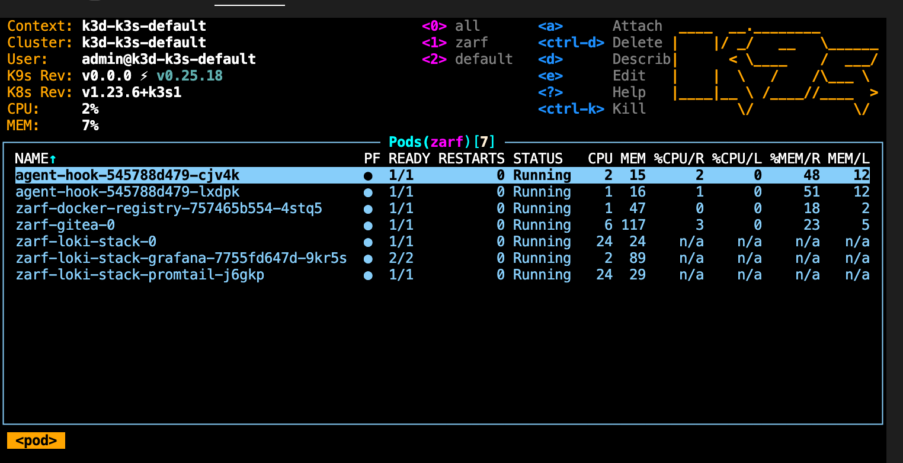

{/*
TODO: finish this page for all embedded CLIs
*/}

## yq

> command: [`zarf tools yq`](/commands/zarf_tools_yq)
>
> aliases: `yq`

Zarf vendors in [`yq`](https://github.com/mikefarah/yq/) to provide a way to interact with YAML files.
`yq` is a lightweight and portable command-line YAML processor. It can be used to extract specific parts of a YAML file, replace or delete values, and more.

## archiver

> command: [`zarf tools archiver`](/commands/zarf_tools_archiver)
>
> aliases: `archiver`, `a`

Zarf uses the great [mholt/archiver](https://github.com/mholt/archiver) library as a dependency to create and extract archives. This libarary also offers itself as a standalone tool that can be used to create and extract archives.

## syft

> command: [`zarf tools sbom`](/commands/zarf_tools_sbom)
>
> aliases: `syft`, `sbom`, `s`

Zarf vendors in [Syft](https://github.com/anchore/syft), a "CLI tool and library for generating a Software Bill of Materials from container images and filesystems".

## k9s

> command: [`zarf tools k9s`](/commands/zarf_tools_monitor)
>
> aliases: `k9s`, `monitor`, `m`

Zarf vendors in [K9s](https://k9scli.io/), a terminal-based UI to interact with your Kubernetes cluster. K9s is not necessary to deploy, manage, or operate Zarf or its deployed packages, but it is a great tool to use when you want to interact with your cluster.

More instructions on how to use k9s can be found on their [documentation site](https://k9scli.io/topics/commands/).
