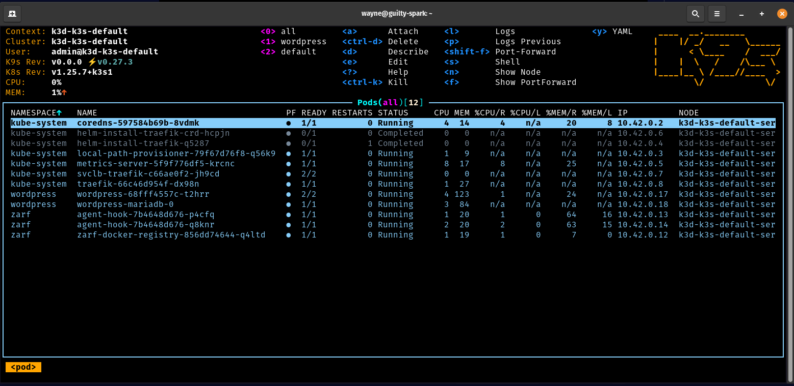

## Introduction

In this tutorial, we will demonstrate how to initialize Zarf onto a K8s cluster. This is done by running the [`zarf init`](/v0.77/commands/zarf_init) command, which uses a specialized package called an 'init-package'. More information about this specific package can be found [here](/v0.77/ref/init-package/).

## Prerequisites

Before beginning this tutorial you will need the following:

* The [Zarf](https://github.com/zarf-dev/zarf) repository cloned: ([`git clone` Instructions](https://docs.github.com/en/repositories/creating-and-managing-repositories/cloning-a-repository))
* Zarf binary installed on your $PATH: ([Installing Zarf](/v0.77/getting-started/install/))
* An init-package downloaded: ([init-package Build Instructions](/v0.77/tutorials/0-creating-a-zarf-package/)) or ([Download Location](https://github.com/zarf-dev/zarf/releases))
* A local Kubernetes cluster

## Initializing the Cluster

1. Run the `zarf init` command on your cluster.

   ```sh
   zarf init
   ```

2. When prompted to deploy the package select `y` for Yes, then hit the `enter` key.

3. Decline Optional Components

:::note
More information about the init-package and its components can be found [here](/v0.77/ref/init-package/)
:::

:::note
You will only be prompted to deploy the k3s component if you are on a Linux machine
:::

### Validating the Deployment

After the `zarf init` command is done running, you should see a few new `zarf` pods in the Kubernetes cluster.

```bash
zarf tools monitor

# Note you can press `0` if you want to see all namespaces and CTRL-C to exit
```



## Cleaning Up

The [`zarf destroy`](/v0.77/commands/zarf_destroy) command will remove all of the resources that were created by the initialization command. This command will leave you with a clean cluster that you can either destroy or use for another tutorial.

```sh
zarf destroy --confirm
```
